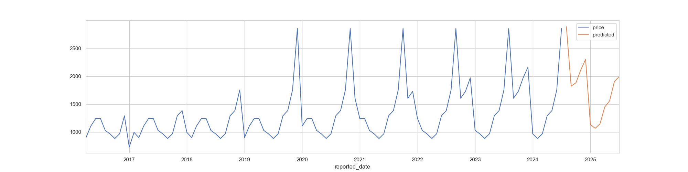

# Requirement
Given Bangalore as the potential market where the Onion produce will be sold to the vendors in, forceast the minimum and maximum purchase price. Consider historical data of atleast 10 years to forecast for the next 1 year.

# Data Source and Data Dictionary

### Data Source
https://agmarknet.gov.in

### Data Dictionary
- State Name: Name of the Indian State.
- District Name: Name of the District.
- Market Name: Name of the Market.
- Variety: Variety of the Onion.
- Group: Undefined.
- Arrivals: Quantity of the produce in Tonnes (1 Tonne = 1000 Kilograms).
- Min Price (Rs./Quintal): Minimum purchase price per quintal (1 Quintal = 100 Kilograms).
- Max Price (Rs./Quintal): Minimum purchase price per quintal (1 Quintal = 100 Kilograms).
- Modal Price (Rs./Quintal): Mode of the purchase price per quintal (1 Quintal = 100 Kilograms).
- Reported Date: Date on which the remaining data points were reported on.

# Approach

# Findings

## Bangalore (Market) - Local (Variety) - Minimum Price

### Time Series

### Time Series Decomposition (Multiplicative)

### Results of Dickey-Fuller Test
P-Value = 0.9971214139590211

This suggests that the Time Series is NOT stationary.

### ACF (Seasonality)

This suggests that the seasonality = 11. Meaning, the seasonality repeats after every 11 months.

### PACF (Confirmation to ACF)

This confirms the seasonality value found using ACF.

### Model - Triple Exponential Smoothing

#### Hyperparameters
- `smoothing_level = (1/ 22)`
- `smoothing_trend = 0.07`
- `smoothing_seasonal = 0.90`

#### Actual v. learnt trend

#### Forecast for the next 12 months

#### Metrics
- MAE (Mean Absolute Error): 187.874
- RMSE (Root Mean Square Error): 331.316
- MAPE (Mean Absolute Percentage Error): 0.145

### Predictions
| date | predicted_purchase_price |
| :-: | :-: |
| 2024-08-01 | 2891.016702 |
| 2024-09-01 | 1823.976515 |
| 2024-10-01 | 1884.983288 |
| 2024-11-01 | 2114.721268 |
| 2024-12-01 | 2304.703993 |
| 2025-01-01 | 1136.547997 |
| 2025-02-01 | 1067.285830 |
| 2025-03-01 | 1148.121995 |
| 2025-04-01 | 1451.718951 |
| 2025-05-01 | 1560.129996 |
| 2025-06-01 | 1906.907879 |
| 2025-07-01 | 1995.992050 |