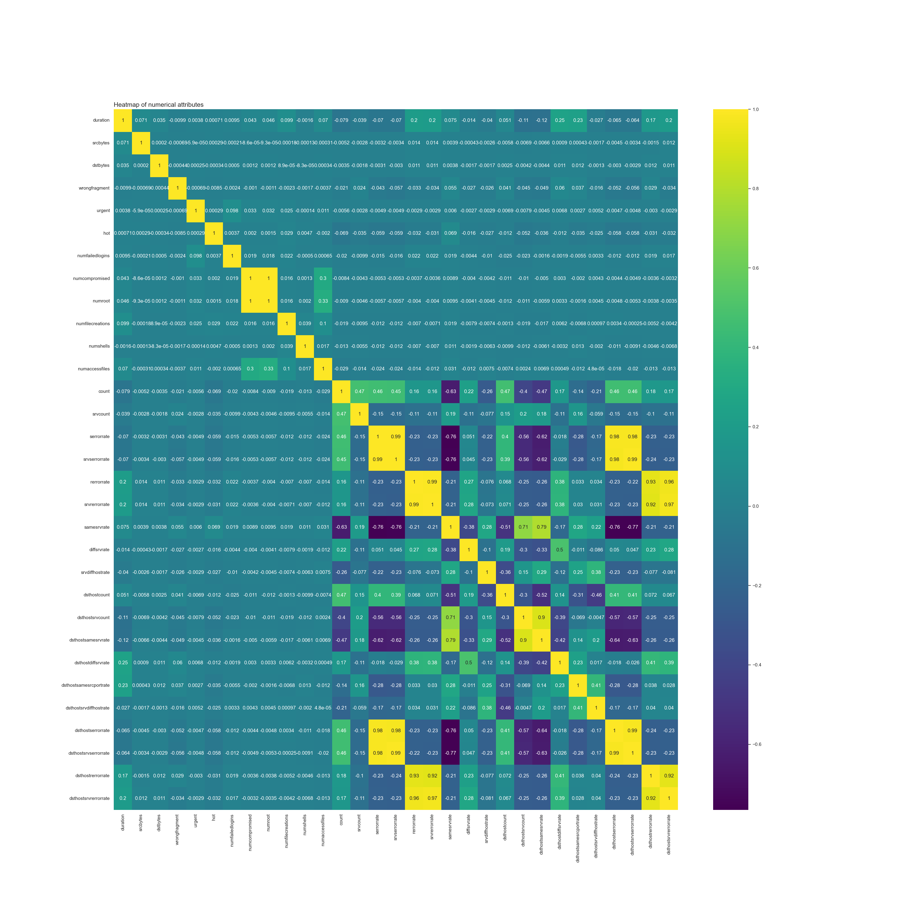

# Problem Statement and Approach
Given data with information regarding different features associated with network, the task is to recognize whether a connection is normal connection, or a type of attack on the network.

### Why is there a need to develop a robust adaptive approach to detect anomalies in the network?
The traditional methods that are commonly deployed to detect anomalies in network rely on predefined set of rules based on known attack patterns. The problem with these is that they fail at recognizing threats that previously have not been encountered. 

Cyber threats are evolving continuously, as in attackers find new ways to find bypass traditional security measures. Also, the network is forever growing, as in, new devices get added to the environment every now and then. Hence maintaining and monitoring theses devices becomes crucial as the network grows in size.

These are the fundamental reasons why there is a need for a system that is both adaptive and robust in detecting such threats in the network. Adaptive, because it has to continuously evolve by learning from the new data, and recognize new threats. Robust, because it has to cater to the need of threat detection in a network that is growing continuously.

### Approach
The suggestion is to take a Machine Learning based approach towards addressing the problem by building an ML model that can be fed with relevant features, and it classifies the connection as either normal or attack. This type of task in ML is called as classification task, more specifically, a binary classification task.

### Additional project info and dataset
Google Docs Link: [link](https://docs.google.com/document/d/1LCHFUQ0cULGp1zC7MrfVBTWWmnZ4L9zgYsULVCdOo5g/edit).


# Data Dictionary
### Basic connection features
- `duration`: Represents the length of time a specific network connection was active for.
- `protocoltype`: Represents the specific commumication protocol used in each connection.
- `service`: Represents the destination network service used in a connection.
- `flag`: Represents the status of a connection as either "Normal" or "Error".
- `srcbytes`: Represents the number of data bytes transferred from the source to the destination in a single connection.
- `dstbytes`: Represents the number of data bytes transferred from the destination to the source in a single connection.
- `land`: Indicates whether the source and destination IP addresses and port numbers are equal (1 if equal, 0 otherwise).
- `wrongfragment`: Represents the total number of wrong fragments received in a connection.
- `urgent`: Represents the number of urgent packets in this connection. Urgent packets are packets with the urgent bit activated.

### Content related features
- `hot`: Represents the number of "hot" indicators in the content, such as entering a system directory, creating programs, and executing programs.
- `numfailedlogins`: Represents the count of failed login attempts.
- `loggedin`: Indicates whether a successful login occurred in a connection (1 if successfully logged in, 0 otherwise).
- `numcompromised`: Represents the number of "compromised" conditions in a connection.
- `rootshell`: Indicates whether root shell access was obtained in a connection (1 if yes, 0 otherwise).
- `suattempted`: Indicates whether the "su root" command was attempted or used in a connection (1 if yes, 0 otherwise).
- `numroot`: Represents the count of root operations performed in a connection.
- `numfilecreations`: Represents the count of file creation operations in a connection.
- `numshell`: Represents the count of shell prompts in a connection.
- `numaccessfile`: Represents the count of operations on access control files in a connection.
- `numoutboundcmds`: Represents the count of outbound commands in an FTP session.
- `ishostlogin`: Indicates whether a login belongs to the host list i.e., root or admin (1 if yes, 0 otherwise).
- `isguestlogin`: Indicates whether a login belongs to the guest list (1 if yes, 0 otherwise).

### Time related traffic features
- `count`: Represents the number of connections to the same destination host as the current connection in the past 2 seconds.
- `srvcount`: Represents the number of connections to the same service as the current connection in the past 2 seconds.
- `serrorrate`: Represents the percentage of connections that have activated the flag s0, s1, s2, or s3, among the connections aggregated in `count`.
- `srvserrorrate`: Represents the percentage of connections that have activated the flag s0, s1, s2, or s3, among the connections aggregated in `srvcount`.
- `rerrorrate`: Represents the percentage of connections that have activated the flag REJ, among the connections aggregated in `count`.
- `srvserrorrate`: Represents the percentage connections that have activated the flag REJ, among the connections aggregated in `srvcount`.
- `samesrvrate`: Represents the percentage of connections that were to the same service, among the connections aggregated in `count`.
- `diffsrvrate`: Represents the percentage of connections that were to different services, among the connections aggregated in `count`.
- `srvdiffhostrate`: Represents the percentage of connections that were to different destination machines, among the connections aggregated in `srvcount`.

### Host based traffic features
- `dsthostcount`: Represents the number of connections having the same destination host IP address.
- `dsthostsrvcount`: Represents the number of connections having the same destination port number.
- `dsthostsamesrvrate`: Represents the percentage of connections that were to the same service, among the connections aggregated in `dsthostcount`.
- `dsthostdiffsrvrate`: Represents the percentage of connections that were to different services, among the connections aggregated in `dsthostcount`.
- `dsthostsamesrcportrate`: Represents the percentage connections that were to the same source port, among the connections aggregated in `dsthostsrvcount`.
- `dsthostsrvdiffhostrate`: Represents the percentage connections that were to different destination machines, among the connections aggregated in `dsthostsrvcount`.
- `dsthostserrorrate`: Represents the percentage connections that have activated the flag s0, s1, s2, or s3, among the connections aggregated in `dsthostcount`.
- `dsthostsrvserrorrate`: Represents the percentage connections that have activated the flag s0, s1, s2, or s3, among the connections aggregated in `dsthostsrvcount`.
- `dsthostrerrorrate`: Represents the percentage connections that have activated the flag REJ, among the connections aggregated in `dsthostcount`.
- `dsthostsrvrerrorrate`: Represents the percentage connections that have activated the flag REJ, among the connections aggregated in `dsthostsrvcount`.

### Others
- `attack`: Represents the specfic attack types.
- `lastflag`: Undefined.


# Data Cleaning
Notebook used: [link](notebooks/data_cleaning.ipynb).

Dataset used: [link](datasets/network_anomaly_dataset.csv).

### Cleaning `suattempted` column
The column `suattempted`, according to the data dictionary (https://github.com/vidishsirdesai/network_anomaly_detection?tab=readme-ov-file#data-dictionary), is supposed to have only 2 values, i.e., 0 and 1. But, as seen in the output of cell number `7` in the jupyter notebook ([link](notebooks/data_cleaning.ipynb)), it has 3 values, i.e., 0, 1, and 2.

Assuming that the presence of 2 in the column is a typo, all the rows in the column `suattempted` where there was a 2 present is changed to 1.

### Adding a new feature that represents a high level classification of attack types
The column `attack` represents the type of attack at a much granular level. The unique attributes in this column are,

```
['normal' 'neptune' 'warezclient' 'ipsweep' 'portsweep' 'teardrop' 'nmap'
 'satan' 'smurf' 'pod' 'back' 'guess_passwd' 'ftp_write' 'multihop'
 'rootkit' 'buffer_overflow' 'imap' 'warezmaster' 'phf' 'land'
 'loadmodule' 'spy' 'perl']
```

A high level classification of these attacks can be created, and the attributes in the column, `attack`, can be assigned to one of the high level classes.

The attacks are majorly classified as follows,
1. Normal (normal): These attacks are considered benign and do not pose a threat.
2. Denial of Service (DoS): These attacks aim to disrupt the normal operation of a network or system by overwhelming it with excessive traffic or malicious requests. Examples include "back", "land", "neptune", "pod", "smurf", and "teardrop".
3. User to Root (U2R): These attacks exploit vulnerabilities in a system to gain unauthorized root-level access. Examples include "buffer_overflow", "loadmodule", "perl", and "rootkit".
4. Remote to Local (R2L): These attacks attempt to gain unauthorized access to a system from a remote location. Examples include "ftp_write", "guess_passwd", "imap", "multihop", "phf", "spy", "warezclient", and "warezmaster".
5. Probe: Probing attacks, which aim to gather information about a network or system. This category includes attacks like "ipsweep", "nmap", and "satan" that scan networks for vulnerabilities and gather information.

Considering all of the above, a new column, namely `attack_hlc`, has been created. Wherein each of the element in the `attack` column has been assigned to its respective high level class.

### Undefined and redundant attributes
There is no description available for the feature `lastflag` in the data dictionary. Hence it has been dropped from the list of columns.

Also, the column `numoutboundcmds` has all zeros. This column can also be dropped from the list of columns.

The new shape of the dataset, after dropping the columns `lastflag` and `numoutboundcmds` column is: 
```
(125973, 42)
```

### State of the dataset after data cleaning
The new dataset with all the above changes made during data cleaning is stored in: [link](datasets/network_anomaly_dataset_cleaned.csv).


# Analysis of Factors Associated with Intrusions in a Network using Tableau
Tableau Viz: 

Dataset used: [link](datasets/network_anomaly_dataset_cleaned.csv).


# EDA
Notebook used: [link](notebooks/eda.ipynb).

Dataset used: [link](datasets/network_anomaly_dataset_cleaned.csv).

### Shape of the data
```
(125973, 42)
```

### Structure of the data and data type of the attributes
```
<class 'pandas.core.frame.DataFrame'>
RangeIndex: 125973 entries, 0 to 125972
Data columns (total 42 columns):
 #   Column                  Non-Null Count   Dtype  
---  ------                  --------------   -----  
 0   duration                125973 non-null  int64  
 1   protocoltype            125973 non-null  object 
 2   service                 125973 non-null  object 
 3   flag                    125973 non-null  object 
 4   srcbytes                125973 non-null  int64  
 5   dstbytes                125973 non-null  int64  
 6   land                    125973 non-null  int64  
 7   wrongfragment           125973 non-null  int64  
 8   urgent                  125973 non-null  int64  
 9   hot                     125973 non-null  int64  
 10  numfailedlogins         125973 non-null  int64  
 11  loggedin                125973 non-null  int64  
 12  numcompromised          125973 non-null  int64  
 13  rootshell               125973 non-null  int64  
 14  suattempted             125973 non-null  int64  
 15  numroot                 125973 non-null  int64  
 16  numfilecreations        125973 non-null  int64  
 17  numshells               125973 non-null  int64  
 18  numaccessfiles          125973 non-null  int64  
 19  ishostlogin             125973 non-null  int64  
 20  isguestlogin            125973 non-null  int64  
 21  count                   125973 non-null  int64  
 22  srvcount                125973 non-null  int64  
 23  serrorrate              125973 non-null  float64
 24  srvserrorrate           125973 non-null  float64
 25  rerrorrate              125973 non-null  float64
 26  srvrerrorrate           125973 non-null  float64
 27  samesrvrate             125973 non-null  float64
 28  diffsrvrate             125973 non-null  float64
 29  srvdiffhostrate         125973 non-null  float64
 30  dsthostcount            125973 non-null  int64  
 31  dsthostsrvcount         125973 non-null  int64  
 32  dsthostsamesrvrate      125973 non-null  float64
 33  dsthostdiffsrvrate      125973 non-null  float64
 34  dsthostsamesrcportrate  125973 non-null  float64
 35  dsthostsrvdiffhostrate  125973 non-null  float64
 36  dsthostserrorrate       125973 non-null  float64
 37  dsthostsrvserrorrate    125973 non-null  float64
 38  dsthostrerrorrate       125973 non-null  float64
 39  dsthostsrvrerrorrate    125973 non-null  float64
 40  attack                  125973 non-null  object 
 41  attackhlc               125973 non-null  object 
dtypes: float64(15), int64(22), object(5)
memory usage: 40.4+ MB
```

### Missing values and duplicates
There are no missing values or duplicates in the data.

### Statistical summary of continuous attributes
```
                           count          mean           std  min    25%     50%     75%           max
duration                125973.0    287.144650  2.604515e+03  0.0   0.00    0.00    0.00  4.290800e+04
srcbytes                125973.0  45566.743000  5.870331e+06  0.0   0.00   44.00  276.00  1.379964e+09
dstbytes                125973.0  19779.114421  4.021269e+06  0.0   0.00    0.00  516.00  1.309937e+09
land                    125973.0      0.000198  1.408607e-02  0.0   0.00    0.00    0.00  1.000000e+00
wrongfragment           125973.0      0.022687  2.535300e-01  0.0   0.00    0.00    0.00  3.000000e+00
urgent                  125973.0      0.000111  1.436603e-02  0.0   0.00    0.00    0.00  3.000000e+00
hot                     125973.0      0.204409  2.149968e+00  0.0   0.00    0.00    0.00  7.700000e+01
numfailedlogins         125973.0      0.001222  4.523914e-02  0.0   0.00    0.00    0.00  5.000000e+00
loggedin                125973.0      0.395736  4.890101e-01  0.0   0.00    0.00    1.00  1.000000e+00
numcompromised          125973.0      0.279250  2.394204e+01  0.0   0.00    0.00    0.00  7.479000e+03
rootshell               125973.0      0.001342  3.660284e-02  0.0   0.00    0.00    0.00  1.000000e+00
suattempted             125973.0      0.000635  2.519243e-02  0.0   0.00    0.00    0.00  1.000000e+00
numroot                 125973.0      0.302192  2.439962e+01  0.0   0.00    0.00    0.00  7.468000e+03
numfilecreations        125973.0      0.012669  4.839351e-01  0.0   0.00    0.00    0.00  4.300000e+01
numshells               125973.0      0.000413  2.218113e-02  0.0   0.00    0.00    0.00  2.000000e+00
numaccessfiles          125973.0      0.004096  9.936956e-02  0.0   0.00    0.00    0.00  9.000000e+00
ishostlogin             125973.0      0.000008  2.817483e-03  0.0   0.00    0.00    0.00  1.000000e+00
isguestlogin            125973.0      0.009423  9.661233e-02  0.0   0.00    0.00    0.00  1.000000e+00
count                   125973.0     84.107555  1.145086e+02  0.0   2.00   14.00  143.00  5.110000e+02
srvcount                125973.0     27.737888  7.263584e+01  0.0   2.00    8.00   18.00  5.110000e+02
serrorrate              125973.0      0.284485  4.464556e-01  0.0   0.00    0.00    1.00  1.000000e+00
srvserrorrate           125973.0      0.282485  4.470225e-01  0.0   0.00    0.00    1.00  1.000000e+00
rerrorrate              125973.0      0.119958  3.204355e-01  0.0   0.00    0.00    0.00  1.000000e+00
srvrerrorrate           125973.0      0.121183  3.236472e-01  0.0   0.00    0.00    0.00  1.000000e+00
samesrvrate             125973.0      0.660928  4.396229e-01  0.0   0.09    1.00    1.00  1.000000e+00
diffsrvrate             125973.0      0.063053  1.803144e-01  0.0   0.00    0.00    0.06  1.000000e+00
srvdiffhostrate         125973.0      0.097322  2.598305e-01  0.0   0.00    0.00    0.00  1.000000e+00
dsthostcount            125973.0    182.148945  9.920621e+01  0.0  82.00  255.00  255.00  2.550000e+02
dsthostsrvcount         125973.0    115.653005  1.107027e+02  0.0  10.00   63.00  255.00  2.550000e+02
dsthostsamesrvrate      125973.0      0.521242  4.489494e-01  0.0   0.05    0.51    1.00  1.000000e+00
dsthostdiffsrvrate      125973.0      0.082951  1.889218e-01  0.0   0.00    0.02    0.07  1.000000e+00
dsthostsamesrcportrate  125973.0      0.148379  3.089971e-01  0.0   0.00    0.00    0.06  1.000000e+00
dsthostsrvdiffhostrate  125973.0      0.032542  1.125638e-01  0.0   0.00    0.00    0.02  1.000000e+00
dsthostserrorrate       125973.0      0.284452  4.447841e-01  0.0   0.00    0.00    1.00  1.000000e+00
dsthostsrvserrorrate    125973.0      0.278485  4.456691e-01  0.0   0.00    0.00    1.00  1.000000e+00
dsthostrerrorrate       125973.0      0.118832  3.065575e-01  0.0   0.00    0.00    0.00  1.000000e+00
dsthostsrvrerrorrate    125973.0      0.120240  3.194594e-01  0.0   0.00    0.00    0.00  1.000000e+00
```

### Value counts and frequency of occurrence of each unique element in each column
Information regarding the value counts of each of the unique attributes can be found here: [link](artifacts/value_counts.txt).

Additionally, the frequency of occurrence of each unique values in each column expressed as a proportion of the total count can found here: [link](artifacts/value_counts_normalized.txt).

### Unique attributes and number of unique attributes in each column
Information regarding the number of unique attributes and the unique attributes in each column can be found here: [link](artifacts/unique_attributes.txt).

### Conversion of data type of certain numerical attributes to categorical attributes
The data type of the following numerical attributes (columns) is converted to categorical,

```
to_categorical = ["land", "loggedin", "rootshell", "suattempted", "ishostlogin", "isguestlogin"]
```

The above numerical attributes have discrete values of 0 and 1, hence it is appropriate to visualize the frequency of the values in these attributes after converting them to categorical data type.

### Numerical and categorical attributes
Numerical attributes: 
```
['duration', 'srcbytes', 'dstbytes', 'wrongfragment', 'urgent', 'hot', 'numfailedlogins', 'numcompromised', 'numroot', 'numfilecreations', 'numshells', 'numaccessfiles', 'count', 'srvcount', 'serrorrate', 'srvserrorrate', 'rerrorrate', 'srvrerrorrate', 'samesrvrate', 'diffsrvrate', 'srvdiffhostrate', 'dsthostcount', 'dsthostsrvcount', 'dsthostsamesrvrate', 'dsthostdiffsrvrate', 'dsthostsamesrcportrate', 'dsthostsrvdiffhostrate', 'dsthostserrorrate', 'dsthostsrvserrorrate', 'dsthostrerrorrate', 'dsthostsrvrerrorrate']
```

Categorical attributes:
```
['protocoltype', 'service', 'flag', 'land', 'loggedin', 'rootshell', 'suattempted', 'ishostlogin', 'isguestlogin', 'attack', 'attackhlc']
```

### Distribution of numerical attributes (using box plots)


### Frequencies of categorical attributes (using count plots)


### Heatmap of numerical attributes


Attributes that are highly correlated to each other:
- `numcompromised` and `numroot`.
- `numroot` and `numcompromised`.
- `serrorrate` and `srvserrorrate`.
- `serrorrate` and `dsthostserrorrate`.
- `serrorrate` and `dsthostsrvserrorrate`.
- `srvserrorrate` and `serrorrate`.
- `srvserrorrate` and `dsthostserrorrate`.
- `srvserrorrate` and `dsthostsrvserrorrate`.
- `rerrorrate` and `srvrerrorrate`.
- `rerrorrate` and `dsthostrerrorrate`.
- `rerrorrate` and `dsthostsrvrerrorrate`.
- `srvrerrorrate` and `rerrorrate`.
- `srvrerrorrate` and `dsthostrerrorrate`.
- `srvrerrorrate` and `dsthostsrvrerrorrate`.
- `dsthostsrvcount` and `dsthostsamesrvrate`.
- `dsthostsamesrvrate` and `dsthostsrvcount`.
- `dsthostserrorrate` and `serrorrate`.
- `dsthostserrorrate` and `srvserrorrate`.
- `dsthostserrorrate` and `dsthostsrvserrorrate`.
- `dsthostsrvserrorrate` and `serrorrate`.
- `dsthostsrvserrorrate` and `srvserrorrate`.
- `dsthostsrvserrorrate` and `dsthostserrorrate`.

Based on the above observations, the attributes that can be removed are,
- `numroot`.
- `srvserrorrate`.
- `dsthostserrorrate`.
- `dsthostsrvserrorrate`.
- `srvrerrorrate`.
- `dsthostrerrorrate`.
- `dsthostsrvrerrorrate`.
- `dsthostsamesrvrate`.

### Outliers
- Number of data points = 125973
- Number of outliers = 31469

### State of the dataset after EDA
The new dataset with all the above changes made during EDA is stored in: [link](datasets/network_anomaly_dataset_eda.csv).


# Hypothesis Testing
Notebook used: [link](notebooks/hypothesis_testing.ipynb).

Dataset used: [link](datasets/network_anomaly_dataset_eda.csv).

### Adding a new feature that represents if a connection is normal or an attack
The `attack_hlc` column created during the data cleaning step (https://github.com/vidishsirdesai/network_anomaly_detection?tab=readme-ov-file#data-cleaning), is used to create another column `normal_or_attack` that has the values 0 or 1. 0 representing a normal connection, and 1 representing an attack.

### Hypothesis 1: Network connections with unusually high or low traffic volumns (bytes transferred) are more likely to be anomalous.
This hypothesis can further be simplified into 2 scenarios,
1.  Network connections with unusually high or low traffic volumes from source to destination are more likely to be anomalous.
2.  Network connections with unusually high or low traffic volumes from destination to source are more likely to be anomalous.

####  Network connections with unusually high or low traffic volumes from source to destination are more likely to be anomalous.
- Null hypothesis (H0): There is no significant difference in the network traffic volume from source to destination of normal connection and attack connection.
- Alternate hypothesis (H1): There is a significant difference in the network traffic volume from source to destination of normal connection and attack connection.
- Test used: Independent Samples T-Test
- Significance level ($\alpha$) = 0.05
- Test result:
```
Ttest_indResult(statistic=-2.101656020563486, pvalue=0.03558539933331456)
```
- Observation: The p-value is lesser than $\alpha$. There is a significant difference in the network traffic volume from source to destination of normal connection and attack connection. 
- Conclusion: Alternate hypothesis (H1) is true.

####  Network connections with unusually high or low traffic volumes from destination to source are more likely to be anomalous.
- Null hypothesis (H0): There is no significant difference in the network traffic volume from destination to source of normal connection and attack connection.
- Alternate hypothesis (H1): There is a significant difference in the network traffic volume from destination to source of normal connection and attack connection.
- Test used: Independent Samples T-Test
- Significance level ($\alpha$) = 0.05
- Test result:
```
Ttest_indResult(statistic=-1.4614241258205836, pvalue=0.14390157812640425)
```
- Observation: The p-value is greater than $\alpha$. This suggests that there is no significant difference in the likelihood of network anomalies among network connections with different traffic volumes from destination to source.
- Conclusion: Null hypothesis (H0) is true.

### Hypothesis 2: Certain protocols are more frequently associated with network anomalies. Are certain protocols more frequently associated with anomalies in the network?
- Null hypothesis (H0): There is no significant difference in the likelihood of network anomalies among different protocol types.
- Alternate hypothesis (H1): There is a significant difference in the likelihood of network anomalies among different protocol types.
- Test used: Chi-Square Test for Independence
- Significance level ($\alpha$) = 0.05
- Test result:
```
Chi2ContingencyResult(statistic=10029.24862778463, pvalue=0.0, dof=2, expected_freq=array([[ 4432.22605638,  3858.77394362],
       [54895.77391187, 47793.22608813],
       [ 8015.00003175,  6977.99996825]]))
```
- Observation: The p-value is less than $\alpha$. There is a significant difference in the likelihood of network anomalies among different protocol types.
- Conclusion: Alternate hypothesis (H1) is true.

### Hypothesis 3: Specific services are targets of network anomalies more often than others.
- Null hypothesis (H0): There is no significant difference in the likelihood of network anomalies among different services.
- Alternate hypothesis (H1): There is no significant difference in the likelihood of network anomalies among different services.
- Test used: Chi-Square Test for Independence
- Significance level ($\alpha$) = 0.05
- Test result:
```
Chi2ContingencyResult(statistic=93240.03213516614, pvalue=0.0, dof=69, expected_freq=array([[9.99669850e+01, 8.70330150e+01],
       [3.90245449e+01, 3.39754551e+01],
       [4.60810380e+02, 4.01189620e+02],
       [1.06916561e+00, 9.30834385e-01],
       [5.10526581e+02, 4.44473419e+02],
       [3.79553793e+02, 3.30446207e+02],
       [3.92383781e+02, 3.41616219e+02],
       [2.91347630e+02, 2.53652370e+02],
       [3.00970121e+02, 2.62029879e+02],
       [2.78517643e+02, 2.42482357e+02],
       [2.87605550e+02, 2.50394450e+02],
       [3.04177617e+02, 2.64822383e+02],
       [4.83423233e+03, 4.20876767e+03],
       [2.32008938e+02, 2.01991062e+02],
       [2.45159675e+03, 2.13440325e+03],
       [1.64491130e+03, 1.43208870e+03],
       [2.59272662e+02, 2.25727338e+02],
       [2.53392251e+02, 2.20607749e+02],
       [9.44607821e+02, 8.22392179e+02],
       [9.37658244e+02, 8.16341756e+02],
       [3.66723806e+03, 3.19276194e+03],
       [2.76913894e+02, 2.41086106e+02],
       [1.06916561e+00, 9.30834385e-01],
       [2.45908091e+02, 2.14091909e+02],
       [2.15640013e+04, 1.87739987e+04],
       [5.34582807e-01, 4.65417193e-01],
       [2.83328888e+02, 2.46671112e+02],
       [1.06916561e+00, 9.30834385e-01],
       [3.45875076e+02, 3.01124924e+02],
       [3.67258389e+02, 3.19741611e+02],
       [2.31474356e+02, 2.01525644e+02],
       [1.59840259e+02, 1.39159741e+02],
       [2.19178951e+02, 1.90821049e+02],
       [2.53926834e+02, 2.21073166e+02],
       [2.29336024e+02, 1.99663976e+02],
       [2.34681852e+02, 2.04318148e+02],
       [2.41096846e+02, 2.09903154e+02],
       [2.16506037e+02, 1.88493963e+02],
       [1.85500234e+02, 1.61499766e+02],
       [1.93518976e+02, 1.68481024e+02],
       [1.92449811e+02, 1.67550189e+02],
       [3.36787169e+02, 2.93212831e+02],
       [1.58236511e+02, 1.37763489e+02],
       [8.98099116e+01, 7.81900884e+01],
       [2.33024646e+03, 2.02875354e+03],
       [2.67291404e+00, 2.32708596e+00],
       [4.16974590e+01, 3.63025410e+01],
       [1.41129861e+02, 1.22870139e+02],
       [3.68862137e+01, 3.21137863e+01],
       [1.16822381e+04, 1.01707619e+04],
       [4.27666246e+00, 3.72333754e+00],
       [4.16974590e+01, 3.63025410e+01],
       [4.59741214e+01, 4.00258786e+01],
       [3.47478825e+01, 3.02521175e+01],
       [3.90940407e+03, 3.40359593e+03],
       [1.30972788e+02, 1.14027212e+02],
       [1.66255253e+02, 1.44744747e+02],
       [2.03676050e+02, 1.77323950e+02],
       [2.90813047e+02, 2.53186953e+02],
       [2.54995999e+02, 2.22004001e+02],
       [1.25787335e+03, 1.09512665e+03],
       [1.60374842e+00, 1.39625158e+00],
       [4.27666246e+00, 3.72333754e+00],
       [3.49617156e+02, 3.04382844e+02],
       [5.34582807e+00, 4.65417193e+00],
       [3.21818850e+02, 2.80181150e+02],
       [4.16974590e+02, 3.63025410e+02],
       [3.68327554e+02, 3.20672446e+02],
       [3.29837592e+02, 2.87162408e+02],
       [3.70465886e+02, 3.22534114e+02]]))
```
- Observation: The p-value is less than $\alpha$. There is a significant difference in the likelihood of network anomalies among different protocol types.
- Conclusion: Alternate hypothesis (H1) is true.

### Hypothesis 4: Error flags in the Flag feature are significantly associated with anomalies.
- Null hypothesis (H0): There is no significant difference in the likelihood of network anomalies between connections with and without error flags.
- Alternate hypothesis (H1): There is a significant difference in the likelihood of network anomalies between connections with and without error flags.
- Test used: Logistic Regression model using `statsmodels.api.Logit`.
- Significance level ($\alpha$) = 0.05
- Test result:
```
                           Logit Regression Results                           
==============================================================================
Dep. Variable:       normal_or_attack   No. Observations:                88181
Model:                          Logit   Df Residuals:                    88152
Method:                           MLE   Df Model:                           28
Date:                Fri, 25 Oct 2024   Pseudo R-squ.:                  0.7843
Time:                        18:11:32   Log-Likelihood:                -13136.
converged:                       True   LL-Null:                       -60904.
Covariance Type:            nonrobust   LLR p-value:                     0.000
==============================================================================
                 coef    std err          z      P>|z|      [0.025      0.975]
------------------------------------------------------------------------------
x1            -0.2024      0.015    -13.848      0.000      -0.231      -0.174
x2            -0.6845      0.015    -46.897      0.000      -0.713      -0.656
x3             0.7548      0.149      5.079      0.000       0.464       1.046
x4             0.4784      0.491      0.974      0.330      -0.484       1.441
x5            -0.0121      0.010     -1.251      0.211      -0.031       0.007
x6            42.4380   6.35e+06   6.69e-06      1.000   -1.24e+07    1.24e+07
x7             0.0084      0.009      0.936      0.349      -0.009       0.026
x8             0.3573      0.011     32.145      0.000       0.336       0.379
x9             0.0149      0.010      1.534      0.125      -0.004       0.034
x10           -0.9678      0.022    -44.610      0.000      -1.010      -0.925
x11           -0.0051      0.038     -0.136      0.892      -0.079       0.068
x12            0.0923      0.013      7.326      0.000       0.068       0.117
x13           -0.0979      0.033     -2.998      0.003      -0.162      -0.034
x14           -0.0822      0.032     -2.580      0.010      -0.145      -0.020
x15            0.0094      0.010      0.910      0.363      -0.011       0.030
x16           -0.0760      0.041     -1.841      0.066      -0.157       0.005
x17        -1599.1823   1.66e+08  -9.63e-06      1.000   -3.25e+08    3.25e+08
x18            6.5118      0.142     45.729      0.000       6.233       6.791
x19           -3.8015      0.091    -41.785      0.000      -3.980      -3.623
x20           -0.0672      0.021     -3.234      0.001      -0.108      -0.026
x21           -0.0635      0.014     -4.566      0.000      -0.091      -0.036
x22            0.2533      0.015     16.778      0.000       0.224       0.283
x23            0.5208      0.022     23.403      0.000       0.477       0.564
x24           -1.1924      0.028    -43.018      0.000      -1.247      -1.138
x25            0.0540      0.016      3.301      0.001       0.022       0.086
x26            0.5627      0.015     36.890      0.000       0.533       0.593
x27            0.3271      0.015     22.189      0.000       0.298       0.356
x28            3.9858      0.168     23.680      0.000       3.656       4.316
x29           -0.4605      0.024    -18.890      0.000      -0.508      -0.413
==============================================================================
```
- Observation:
       - The "flag" attribute is represented by "x28" in the above table.
       - The coefficient of this attribute is positive, and is also statistically significant (p-value < 0.05).
       - This indicates that the "flag" attribute is positively is associated with the anomalies.
- Conclusion: Alternate hypothesis (H1) is true.

### Hypothesis 5: Connections that include urgent packets are more likely to be anomolous.
- Null hypothesis (H0): There is no significant difference in the likelihood of network anomalies between connections with and without urgent packets.
- Alternate hypothesis (H1): There is a significant difference in the likelihood of network anomalies between connections with and without urgent packets.
- Test used: Logistic Regression model using `statsmodels.api.Logit`.
- Significance level ($\alpha$) = 0.05
- Test result:
```
                           Logit Regression Results                           
==============================================================================
Dep. Variable:       normal_or_attack   No. Observations:                88181
Model:                          Logit   Df Residuals:                    88152
Method:                           MLE   Df Model:                           28
Date:                Fri, 25 Oct 2024   Pseudo R-squ.:                  0.7843
Time:                        18:11:32   Log-Likelihood:                -13136.
converged:                       True   LL-Null:                       -60904.
Covariance Type:            nonrobust   LLR p-value:                     0.000
==============================================================================
                 coef    std err          z      P>|z|      [0.025      0.975]
------------------------------------------------------------------------------
x1            -0.2024      0.015    -13.848      0.000      -0.231      -0.174
x2            -0.6845      0.015    -46.897      0.000      -0.713      -0.656
x3             0.7548      0.149      5.079      0.000       0.464       1.046
x4             0.4784      0.491      0.974      0.330      -0.484       1.441
x5            -0.0121      0.010     -1.251      0.211      -0.031       0.007
x6            42.4380   6.35e+06   6.69e-06      1.000   -1.24e+07    1.24e+07
x7             0.0084      0.009      0.936      0.349      -0.009       0.026
x8             0.3573      0.011     32.145      0.000       0.336       0.379
x9             0.0149      0.010      1.534      0.125      -0.004       0.034
x10           -0.9678      0.022    -44.610      0.000      -1.010      -0.925
x11           -0.0051      0.038     -0.136      0.892      -0.079       0.068
x12            0.0923      0.013      7.326      0.000       0.068       0.117
x13           -0.0979      0.033     -2.998      0.003      -0.162      -0.034
x14           -0.0822      0.032     -2.580      0.010      -0.145      -0.020
x15            0.0094      0.010      0.910      0.363      -0.011       0.030
x16           -0.0760      0.041     -1.841      0.066      -0.157       0.005
x17        -1599.1823   1.66e+08  -9.63e-06      1.000   -3.25e+08    3.25e+08
x18            6.5118      0.142     45.729      0.000       6.233       6.791
x19           -3.8015      0.091    -41.785      0.000      -3.980      -3.623
x20           -0.0672      0.021     -3.234      0.001      -0.108      -0.026
x21           -0.0635      0.014     -4.566      0.000      -0.091      -0.036
x22            0.2533      0.015     16.778      0.000       0.224       0.283
x23            0.5208      0.022     23.403      0.000       0.477       0.564
x24           -1.1924      0.028    -43.018      0.000      -1.247      -1.138
x25            0.0540      0.016      3.301      0.001       0.022       0.086
x26            0.5627      0.015     36.890      0.000       0.533       0.593
x27            0.3271      0.015     22.189      0.000       0.298       0.356
x28            3.9858      0.168     23.680      0.000       3.656       4.316
x29           -0.4605      0.024    -18.890      0.000      -0.508      -0.413
==============================================================================
```
- Observation:
       - The "urgent" attribute is represented by "x7" in the above table.
       - Although the coefficient of this attribute is positive, is is not statistically significant (p-value > 0.05).
       - This suggests that while there might be a slight positive association between urgent packets and anomalies, the evidence is not strong enough to conclude a significant relationship.
- Conclusion: Null hypothesis (H0) is true.