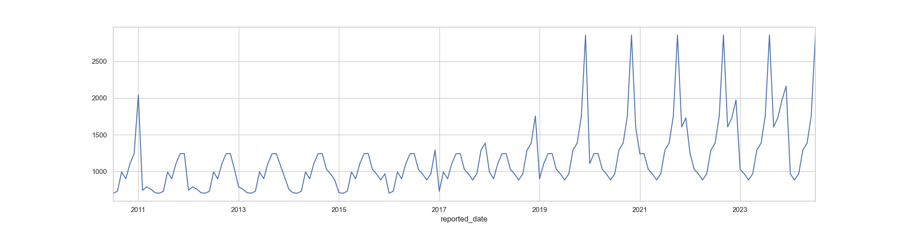

# Introduction
One of the serious problems faced by a farmer is securing a decent selling price for his/ her produce from the vendors in various market places. The purchase prices for different kinds of produce fluctuate throughout the year. Consider that a produce was harvested at a specific time of the year, and was sold to a vendor in the nearest market place around the same time. Now consider that, during this time of the year, the purchase price for that produce was the lowest. This obviously, makes it difficult for a farmer to get a good price for the produce, and sometimes they may have to sell the produce at a price which does not even help them recover the expenses that were borne.

The ground reality is that, the farmers have no clue about the fluctuating trends of the purchase prices of a cetain produce throughout the year which are governed by factors like demand v. supply.

Now consider, if a farmer has the information about the ongoing and statistically predicted future trends of a specific kind of produce that he/ she plans to grow, it will help them make an informed decision about the time at which they should plan to sell their produce.

To address this concern, a variety of onion (local) is chosen as the target produce and the city of Bangalore is chosen as the target market place where it will be sold in and data was collected for the same for the last 10 years. There after, multiple Time Series forecasting models were build as a part of the experiment to find the best model that predicts the optimum minimum purchase of the onion variety for the next 1 year in Bangalore market place.

# Data Source and Data Dictionary
### Data Source
https://agmarknet.gov.in

### Data Dictionary
- State Name: Name of the Indian State.
- District Name: Name of the District.
- Market Name: Name of the Market.
- Variety: Variety of the Onion.
- Group: Undefined.
- Arrivals: Quantity of the produce in Tonnes (1 Tonne = 1000 Kilograms).
- Min Price (Rs./Quintal): Minimum purchase price per quintal (1 Quintal = 100 Kilograms).
- Max Price (Rs./Quintal): Minimum purchase price per quintal (1 Quintal = 100 Kilograms).
- Modal Price (Rs./Quintal): Mode of the purchase price per quintal (1 Quintal = 100 Kilograms).
- Reported Date: Date on which the remaining data points were reported on.

# Insights
### Time Series


### Time Series Decomposition (Multiplicative)


### Results of Dickey-Fuller Test
P-Value = 0.9971214139590211

This suggests that the Time Series is NOT stationary.

### ACF (Seasonality)


This suggests that the seasonality = 11. Meaning, the seasonality repeats after every 11 months.

### PACF (Confirmation to ACF)


This confirms the seasonality value found using ACF.

# Deployment Steps
### Virtual environment setup
1. `cd <project_directory_path>`.
2. `pip install virtualenv`.
3. `python<version> -m venv <virtual_environment_name>` or `python3 -m venv .venv`.
4. A folder named "`.venv`" will appear in the project directory.
5. Activate the virtual environment using one of the commands listed below depending on the Operating System,
    - MacOS and Linux, `source .venv/bin/activate`.
    - Windows command prompt, `.venv/Scripts/activate.bat`.
6. Once the virtual environment is active, the environment name (in this case "`.venv`") will be visible in the parantheses before the prompt, like so "`(.venv)`".
7. To confirm if the virtual environment has successfully been create, run `pip list`. The following should be the output,
```
(.venv) vidish@Vidishs-MacBook-Air network_anomaly_detection % pip list
Package    Version
---------- -------
pip        xx.x.x
setuptools xx.x.x
``` 
8. To deactivate the virtual environment, strictly run the following 2 commands in the same order,
    - `deactivate`.
    - `rm -r .venv`.

### Installing dependencies
1. Once the virtual environment is created, create a `.txt` file named, `requirement.txt`.
2. Add the names of the dependent (required) packages (libraries) that are required by the app to be functioning. The below is the list of packages that are required,
```
flask
pickle
pandas
scikit-learn
```
3. Once the `requirement.txt` file is created with all the dependencies included as a part of the file, save the file and run `pip install -r requirements.txt` from the terminal.
4. `pip list` can be run to check if the installation of all the packages has been successful.

### Onion price predictor model
Triple Exponential Smooting was found to be the best model with the following combination of hyperparametes,
- `smoothing_level = (1/ 22)`
- `smoothing_trend = 0.07`
- `smoothing_seasonal = 0.90`

The plot of actual v. learnt trends from the model is as follows,


The following is the performance of the model on various metrics,
- MAE (Mean Absolute Error): 187.874
- RMSE (Root Mean Square Error): 331.316
- MAPE (Mean Absolute Percentage Error): 0.145

### Onion price predictor app
1. To run the application,
    - `cd src`.
    - `FLASK_APP=onion_price_predictor.py flask run`.
2. To view the welcome page, goto, http://127.0.0.1:5000/.
3. To view the forecast for the next 12 months, goto, http://127.0.0.1:5000/forecast.

# API Specification
### Base URL
http://127.0.0.1:5000/

### Endpoints
- GET /: Returns a welcome message indicating the application's purpose and a button that redirects to `http://127.0.0.1:5000/forecast`.
- GET /forecast: 