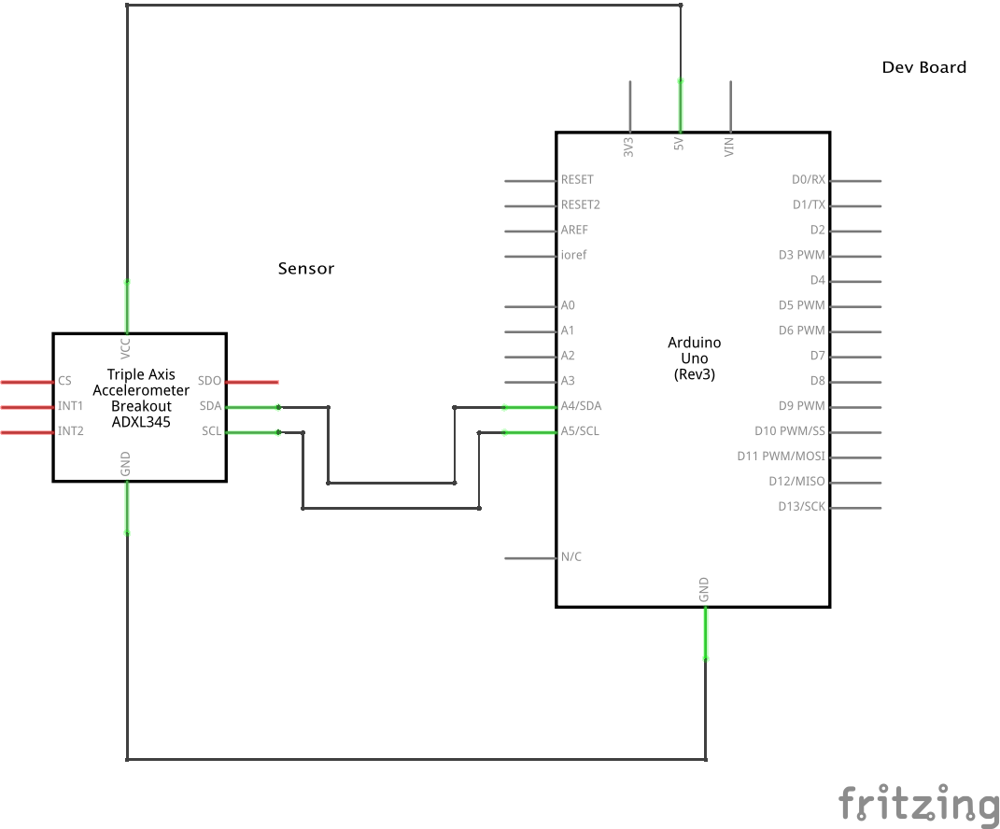
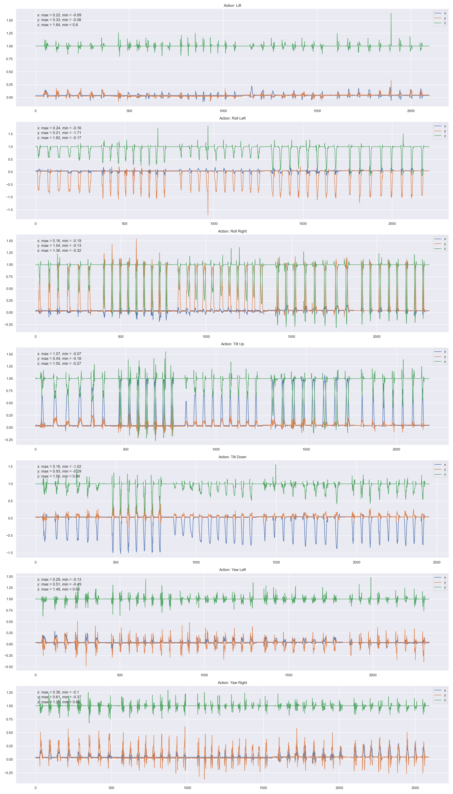

# Introduction

# Data collection Using Arduino UNO R3 and ADXL345

### Schematic diagram

### Firmware code

Link: https://github.com/vidishsirdesai/dynamic_motion_classifier/blob/main/firmware/firmware.ino

### Terminal commands to capture the sensor readings
- `cd <project_directory_path>`.
- `sudo lsof | grep <device_file_path>`.
- `sudo kill -9 <PID>`.
- `arduino-cli monitor --port <device_file_path> --config baudrate=9600 > <log_file_name>.csv`.

# Data Visualization
Sensor reading for 7 different actions (mentioned below) has been collected from 5 volunteers.
- Lift,
- Roll left,
- Roll right,
- Tilt up,
- Tilt down,
- Yaw left,
- Yaw right.

The line plot looks as follows,

