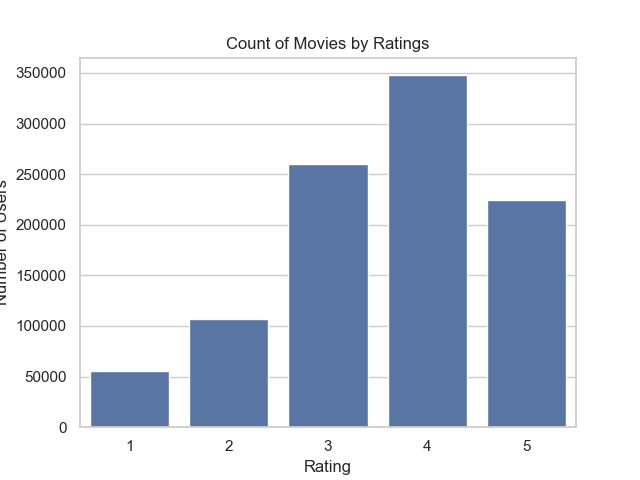

# Introduction
Recomender systems are a type of information filtering system that predict the ratings or preference a user would give to an item. They'are designed to suggest items that are most pertinent to a particular user.

Types of recommender systems,
- Collaborative filtering: Recommends items based on the preferences of similar users.
- Content-based filtering: Recommends items based on the user's past interactions with similar items.
- Hybrid systems: Collabrative and and content-based filtering are combined for more accurate recommendation.

Common use cases include,
- Product recommendations: E-commerce platforms like Amazon and Netflix use them to suggest products or movies to users.
- Music and media: Spotify, YouTube and Pandora use them to recommend songs, videos and podcasts.
- News and content: News aggregators and social media platforms use them to personalize news feeds and content recommendations.
- Job recommnedations: Job boards use them to match job seekers with suitable job openings.

Given are a 3 dataset containing information about users, ratings and movies for a streaming platform. Using nearest neighbors algorithm and cosine similarity, an item-based collaborative filtering recommender system application is built as a part of this project.

# Insights From The Dataset
The following shows the count plot of movies by release decade,


The following shows the count plot of movies by ratings,



The following shows the distribution plot of users on the platforms by age,


The following shows the distribution plot of users on the platform by occupation,


The following shows the percentage share of users on the platform by gender,


# Deployment Steps
### Virtual environment setup
1. `cd <project_directory_path>`.
2. `pip install virtualenv`.
3. `python<version> -m venv <virtual_environment_name>` or `python3 -m venv .venv`.
4. A folder named "`.venv`" will appear in the project directory.
5. Activate the virtual environment using one of the commands listed below depending on the Operating System,
    - MacOS and Linux, `source .venv/bin/activate`.
    - Windows command prompt, `.venv/Scripts/activate.bat`.
6. Once the virtual environment is active, the environment name (in this case "`.venv`") will be visible in the parantheses before the prompt, like so "`(.venv)`".
7. To confirm if the virtual environment has successfully been create, run `pip list`. The following should be the output,
```
(.venv) vidish@Vidishs-MacBook-Air network_anomaly_detection % pip list
Package    Version
---------- -------
pip        xx.x.x
setuptools xx.x.x
``` 
8. To deactivate the virtual environment, strictly run the following 2 commands in the same order,
    - `deactivate`.
    - `rm -r .venv`.

### Installing dependencies
1. Once the virtual environment is created, create a `.txt` file named, `requirement.txt`.
2. Add the names of the dependent (required) packages (libraries) that are required by the app to be functioning. The below is the list of packages that are required,
```
numpy
pandas
sklearn
flask
pickle
```
3. Once the `requirement.txt` file is created with all the dependencies included as a part of the file, save the file and run `pip install -r requirements.txt` from the terminal.
4. `pip list` can be run to check if the installation of all the packages has been successful.

### Show recommender app
1. To run the application,
    - `cd src`.
    - `FLASK_APP=show_recommender_app.py flask run`.
2. To view the welcome page, goto, http://127.0.0.1:5000.
3. To classify the anomaly type or the attack type, send a POST request to, http://127.0.0.1:5000/recommendations.
4. The POST request can be sent by running the following command in a terminal window:
```
curl -X POST -H 'Content-Type: application/json' -d '{"movie_name": "Liar Liar"}' http://127.0.0.1:5000/recommedations
```
5. Expected response: `{"0":"Mrs. Dalloway","1":"Abyss, The","2":"Duets","3":"Holy Smoke","4":"Way of the Gun, The","5":"Wedding Gift, The","6":"Auntie Mame","7":"Theory of Flight, The","8":"Leading Man, The","9":"Mask of Zorro, The"}`.

# API Specification
### Base URL
http://127.0.0.1:5000

### Endpoints
- GET `/`: Returns a text indicating the application's purpose.
- POST `/recommendations`: Returns an output containing recommendations.

### Request format for POST /recommendations
Content-Type: application/json

The request body should be a JSON object containing the following features of a network connection,
- `movie_name` (str): Name of a movie (for example, "Chariots of Fire", "Mission: Impossible", "Jungle Book, The", "Rush Hour", "Liar Liar").

### Response format for POST /recommendations
The response will be a JSON object containing the names of movies that are similar to the queried movie.
