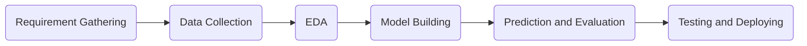

# Introduction
The machine learning framework looks as follows,

Consider steps 1 to 5 (requirement gathering to prediction and evaluation) and call it as a process. This process is not a one time thing, but an iterative process. Meaning, the model is trained, prediction is made and the performance of the is evaluated. Thereafter, hyperparameter are tuned and the model is re-trained and re-evaluated. This process of re-training and re-evaluation may some times be repeated for 100 to 1000 times, to find the one perfect combination of hyperparameters.

Obviously to keep a track of all these experiments becomes a tedious task, if there are a dozen hyperparameters that are being tuned. This is where experiment tracking tools come into the picture.

# What is Experiment Tracking?
Experiment trackinf in machine learning refers to the process of recording and organizing information about the machine learning experiments. This includes logging parameters, metrics, artifacts, and other relevant data associated with each run.

### Key components of experiment tracking
- Parameters: These are the input values that are set for machine learning model, such as hyperparameters, data preprocessing steps, and model architecture.
- Metrics: These are the output values that the model produces, such as, accuracy, precision, recall, F1 score, and loss.
- Artifacts: These are any files or data generated during the experiment, such as trained models, prediction, and visualizations.

### Benefits of experiment tracking
- Improved reproducibility: By logging all relevant information about the experiments, they can be easily reproduced and the results can be compared.
- Enhanced collaboration: Experiment tracking can help teams collaborate more effectively by providing a shared repository for experiment data.
- Simplified model selection: By tracking the performance of different models and configurations, the best model for the task can be easily selected.
- Facilitated debugging: If issues with experiments are encountered, experiment tracking can help in identifying the root cause by examining the logs.

### Tools for experiment tracking
- MLflow: A popular open-source platform for managing the machine learning lifecycle.
- TensorBoard: A visualization tool for TensorFlow that can also be used for experiment tracking.
- Comet.ml: A cloud-based platform for experiment tracking and collaboration.
- Weights & Biases: A cloud-based platform for experiment tracking and visualization.

# What is MLflow?
MLflow is an open-source platform designed to streamline the machine learning lifecycle. It provides tools for managing, tracking, and deploying machine learning models.

### Key components of MLflow
- Tracking: This components helps to record and compare experiments, logging parameters, metrics, and artifacts associated with each run.
- Projects: MLflow projects provide a way to package the ML code into reproducible units, making it easier to share and collaborate.
- Models: This component offers a standard format for packaging and deploying models, ensuring compatibility with various serving platforms.
- Registry: The MLflow registry is a centralized repository for managing the lifecycle of the models, including versioning, staging and production deployment.

### Benefits of MLflow
- Improved reproducibility: MLflow helps to ensure that experiments can be easily replicated and understood.
- Enhanced collaboration: Teams can share and collaborate on machine learning projects more effectively.
- Simplified model deployment: MLflow provides tools for packaging and deploying models to various serving platforms.
- Centralized model management: The MLflow registry offers a centralized location for managing the lifecycle of the models.

# Excercise
1. Install MLflow using the command, `pip install mlflow`.
2. Create a Jupyter Notebook with the name `experiment_tracking.ipynb` (the name can be anything).
3. Once the experiment is run in the notebook, goto the project directory and run the command, `mlflow ui`.
4. Open http://127.0.0.1:5000 in the browser to see the experiment logs.
