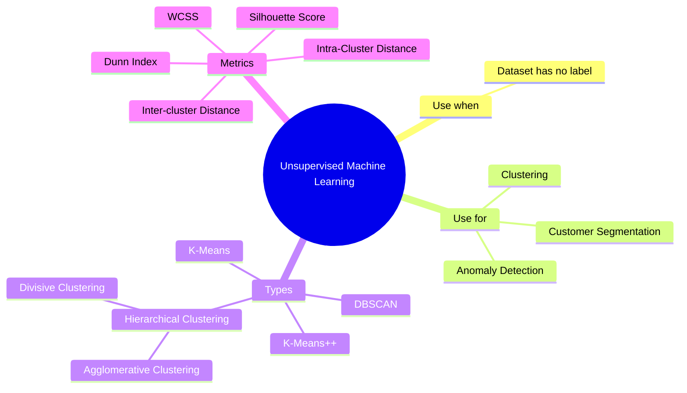

```mermaid
mindmap
    root((Unsupervised Machine Learning))
        Use when
            Dataset has no label
        Use for
            Clustering
            Customer Segmentation
            Anomaly Detection
        Types
            K-Means
            K-Means++
            Hierarchical Clustering
                Agglomerative Clustering
                Divisive Clustering
            DBSCAN
        Metrics
            Inter-cluster Distance
            Intra-Cluster Distance
            WCSS
            Dunn Index
            Silhouette Score
```