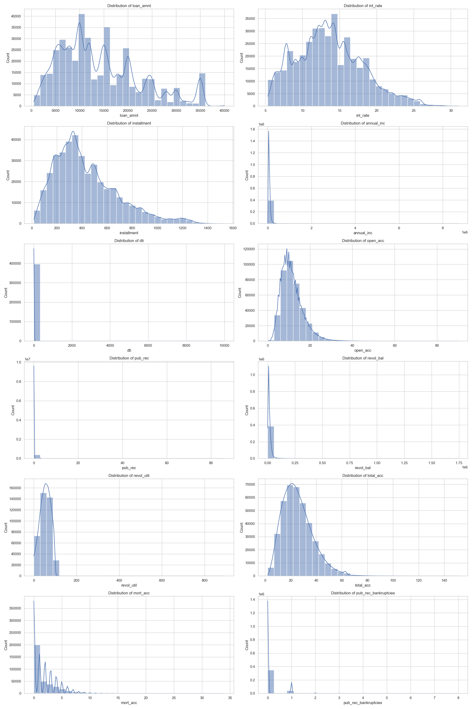
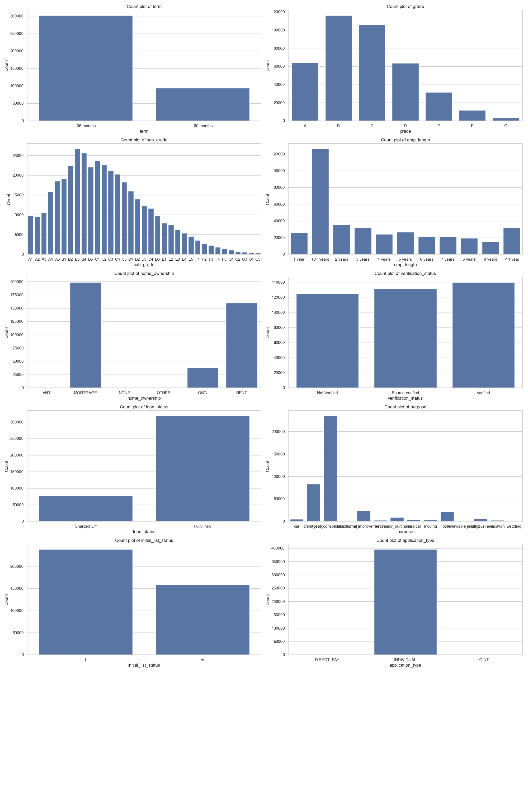
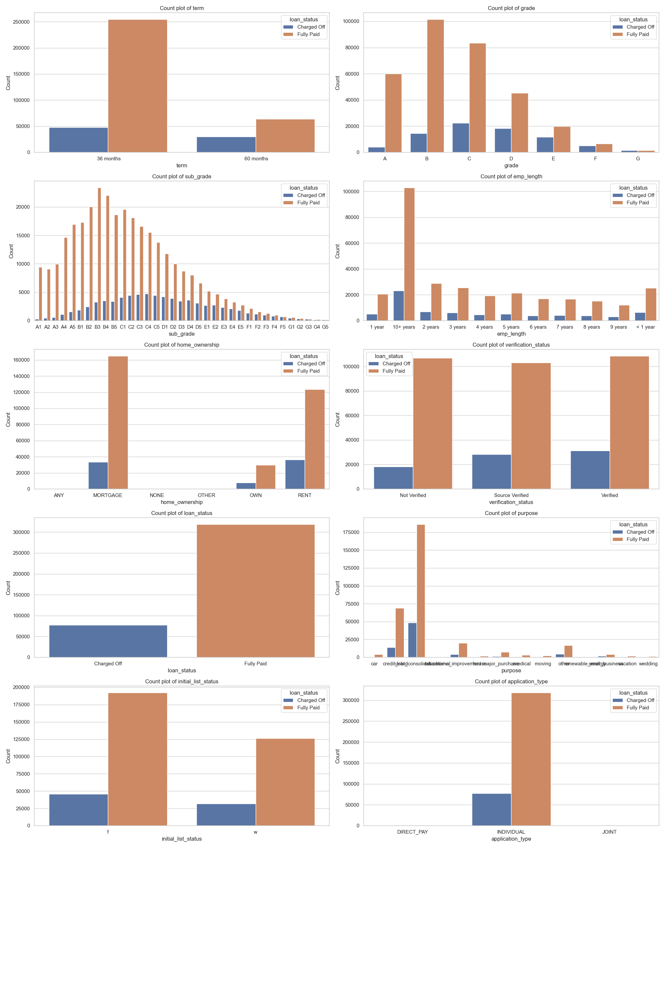
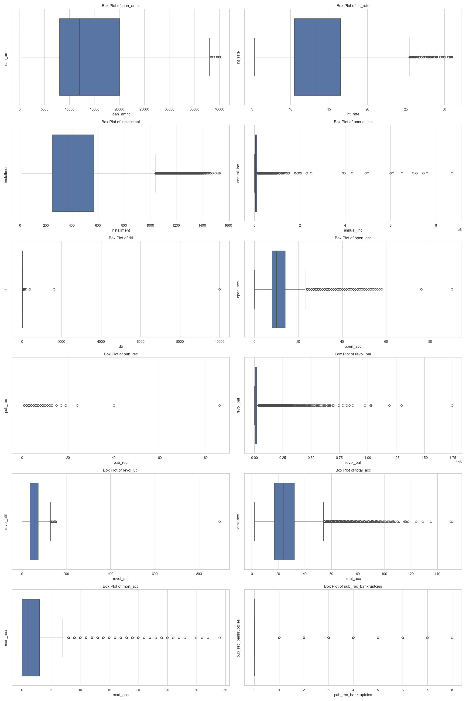
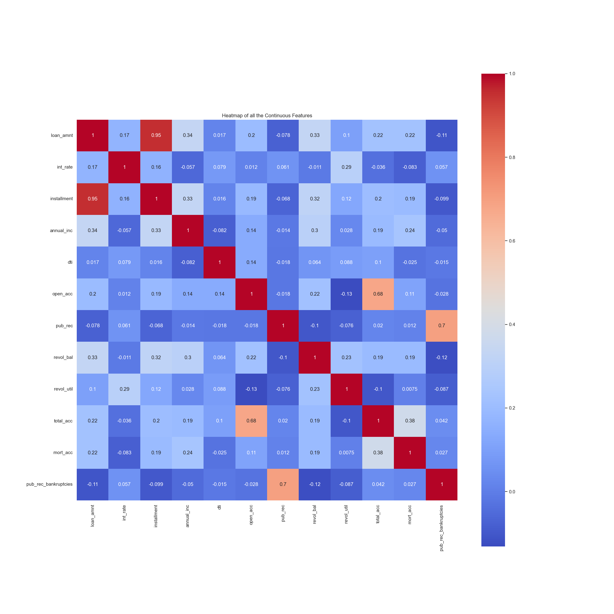
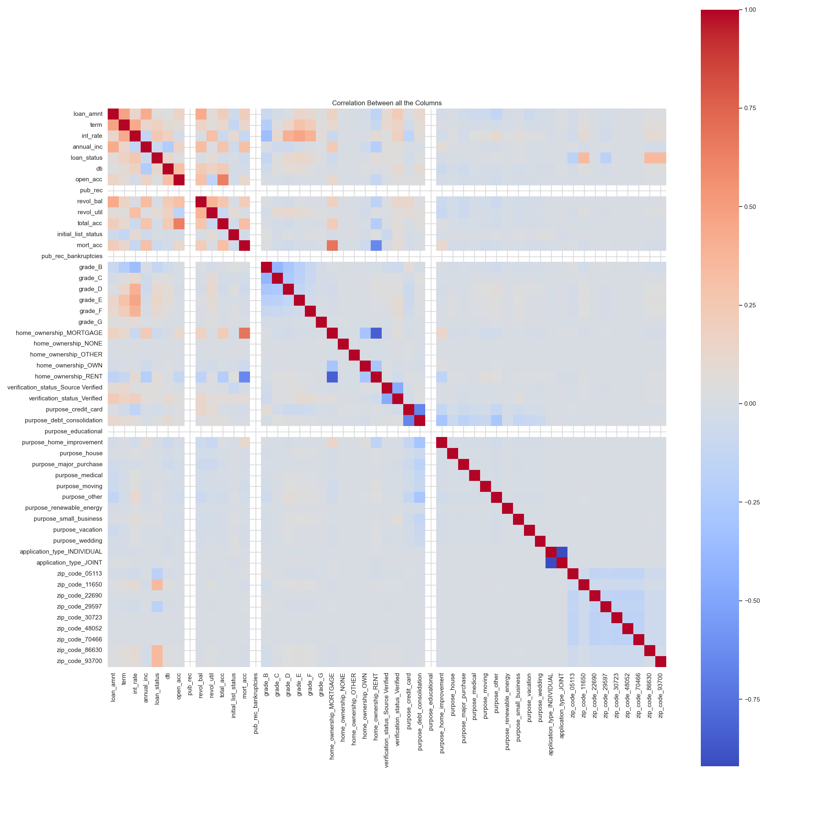
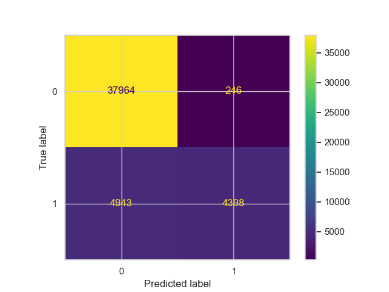
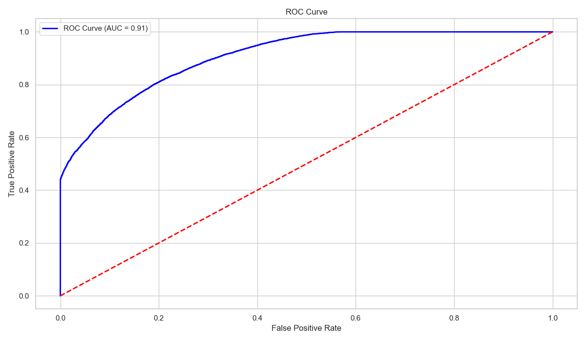
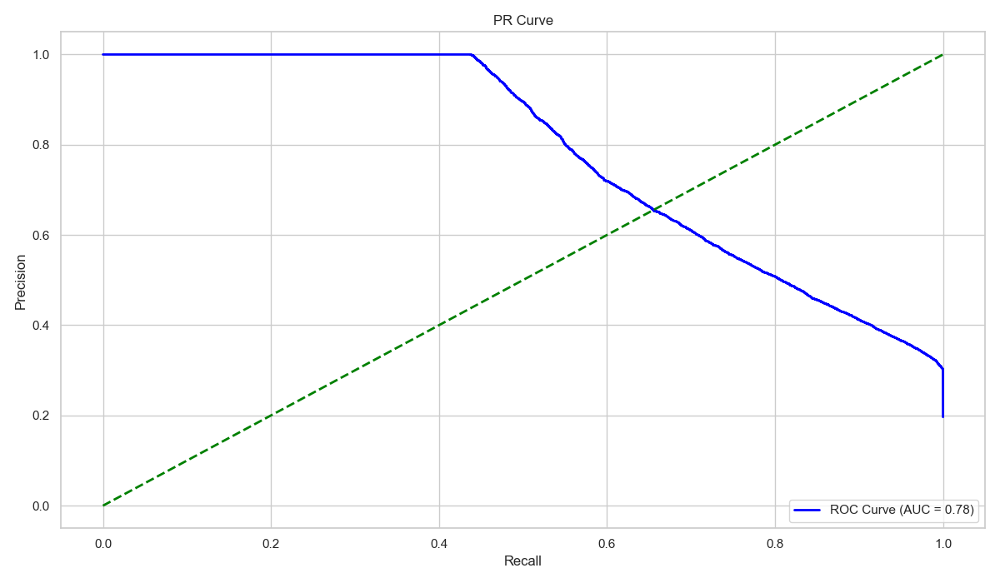

# Introduction
A loan underwriter is a financial professional who evaluates loan applications to determine the risk involved in lending money to a borrower. They play a crucial role in the leading process by assessing the borrower's creditworthiness and ensuring that the loan meets the lender's guidelines.

To automate the task of a loan underwriter, a Logistic Regression model is trained using a dataset containing 27 relevant feature. The for a new data point, the model outputs if a credit line should be approved or not approved to an applicant.

# Jupyter Notebook
[EDA and model building](notebooks/eda_and_model_building.ipynb)

# Insights
### Distribution plots
The distribution plots of all the numerical columns is as follows,



Comments
- Most of the data is left skewed.
- The most popular loan amount is 10000.
- The most popular interest rate is 15%.
- The most popular number of installments are between 200 and 400.

### Count plots
The count plots of all the categorical columns is as follows,



The count plots of all the categorical columns with target column ("loan_status") in hue is as follows,



Comments,
- The most popular repayment term chosen is 36 months.
- The grade of majority of individuals who have repaid the loan is "B".
- Individuals with an employment rate of 10+ years have taken a loan.
- The highest number of individuals who have taken a loan have mortgaged their home.
- Most of the loan taken (almost 80%) has been fully paid.
- The most popular reason for taking loan is debt consolidation.
- The highest number of loan application type is individual.

### Box plots
The box plots of all the numerical columns is as follows,



### Heatmaps
The heatmap of all the numerical columns is as follows,



Comments,
- `loan_amnt` and `installment` have very high correlation, one of the columns can be dropped.

The hearmap of all the columns post feature engineering is as follows,



# Deployment Steps
### Virtual environment setup
1. `cd <project_directory_path>`.
2. `pip install virtualenv`.
3. `python<version> -m venv <virtual_environment_name>` or `python3 -m venv .venv`.
4. A folder named "`.venv`" will appear in the project directory.
5. Activate the virtual environment using one of the commands listed below depending on the Operating System,
    - MacOS and Linux, `source .venv/bin/activate`.
    - Windows command prompt, `.venv/Scripts/activate.bat`.
6. Once the virtual environment is active, the environment name (in this case "`.venv`") will be visible in the parantheses before the prompt, like so "`(.venv)`".
7. To confirm if the virtual environment has successfully been create, run `pip list`. The following should be the output,
```
(.venv) vidish@Vidishs-MacBook-Air loan_underwriter % pip list
Package    Version
---------- -------
pip        xx.x.x
setuptools xx.x.x
``` 
8. To deactivate the virtual environment, strictly run the following 2 commands in the same order,
    - `deactivate`.
    - `rm -r .venv`.

### Installing dependencies
1. Once the virtual environment is created, create a `.txt` file named, `requirements.txt`.
2. Add the names of the dependent (required) packages (libraries) that are required by the app to be functioning. The below is the list of packages that are required,
```
flask
pickle
pandas
scikit-learn
```
3. Once the `requirements.txt` file is created with all the dependencies included as a part of the file, save the file and run `pip install -r requirements.txt` from the terminal.
4. `pip list` can be run to check if the installation of all the packages has been successful.

### Loan underwriter classification model
A Logistic Regression model is build to perform the task of classification. The model attained an accuracy of 89.08% on the test set.

The Confusion Matrix looks as follows,



The ROC AUC curve looks as follows,



The PR curve looks as follows,



### Loan underwriter app
1. This app has been built and has been tested on Python version: `3.11.9`.
2. To run the application,
    - `cd src`.
    - `FLASK_APP=loan_underwriter_app.py flask run`.
3. To view the welcome page, goto, http://127.0.0.1:5000.
4. To classify the anomaly type or the attack type, send a POST request to, http://127.0.0.1:5000/classify.
5. The POST request can be sent by running the following command in a terminal window:
```
curl -X POST -H 'Content-Type: application/json' -d '{"loan_amnt": 19050.0, "term": 0, "int_rate": 13.33, "annual_inc": 90000.0, "dti": 26.08, "open_acc": 12.0, "pub_rec": 0, "revol_bal": 19908.0, "revol_util": 80.0, "total_acc": 24.0, "initial_list_status": 1, "mort_acc": 1, "pub_rec_bankrupticies": 0, "grade": "C", "home_ownership": "MORTGAGE", "verification_status": "Verified", "purpose": "debt_consolidation", "application_type": "INDIVIDUAL", "zip_code": "05113"}' http://127.0.0.1:5000/classify
```
6. Expected response: `{"Loan Status":"Not Approved"}`.

# API Specification
### Base URL
http://127.0.0.1:5000

### Endpoints
- GET `/`: Returns a text indicating the application's purpose.
- POST `/classify`: Returns an output indicating whether a loan application is "Approved" or "Not Approved".

### Request format for POST /classify
Content-Type: application/json

The request body should be a JSON object containing the following features of a network connection,
- `loan_amnt` (float): The listed amount of the loan applied for by the borrower. If at some point in time, the credit department reduces the loan amount, then it will be reflected in this value.
- `term` (int): The number of payments on the loan. Values are in months and can be either 36 or 60.
- `int_rate` (float): Interest Rate on the loan.
- `annual_inc` (float): The self-reported annual income provided by the borrower during registration.
- `dti` (float): A ratio calculated using the borrower’s total monthly debt payments on the total debt obligations, excluding mortgage and the requested loan, divided by the borrower’s self-reported monthly income.
- `open_acc` (float): The number of open credit lines in the borrower's credit file.
- `pub_rec` (int): Number of derogatory public records.
- `revol_bal` (float): Total credit revolving balance.
- `revol_util` (float): Revolving line utilization rate, or the amount of credit the borrower is using relative to all available revolving credit.
- `total_acc` (float): The total number of credit lines currently in the borrower's credit file.
- `intial_list_status` (int): The initial listing status of the loan.
- `mort_acc` (int): Number of mortgage accounts.
- `pub_rec_bankrupticies` (int): Number of public record bankruptcies
- `grade` (str): Assigned loan grade.
- `home_ownership` (str): he home ownership status provided by the borrower during registration or obtained from the credit report.
- `verification_status` (str): Indicates if income was verified, not verified, or if the income source was verified.
- `purpose` (str): A category provided by the borrower for the loan request.
- `application_type` (str): Indicates whether the loan is an individual application or a joint application with two co-borrowers
- `zip_code` (str): The area zip-code of the applicant.

### Response format for POST /classify
The response will be a JSON object with the following key,
- `Loan Status`: The value attached to this key is a string indicating one of the predicted statuses,
    - "Approved": If the loan application is accepted.
    - "Not Approved": If the loan application is rejected.
