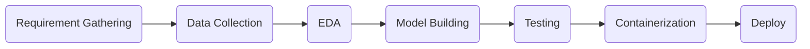
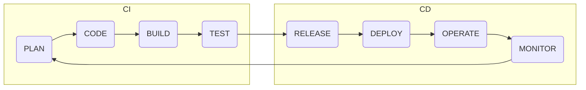
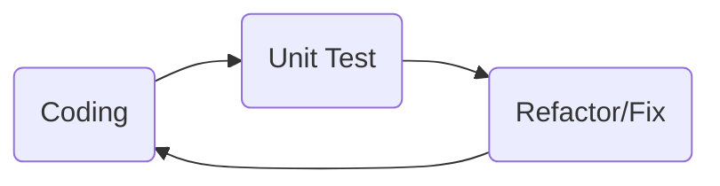

# Introduction
The following flowchart shows the lifecycle of an ML project,



In the lifecycle above the code changes keep happening quite frequently at different steps, and it is imperative to make sure that after code commit, the code does not break. Hence, developers carry out unit tests to ensure that their addition to the code base has not had a disastrous effect.

This task of developing, testing, and deploying is a tedious task if done manually. This is where automated pipelines come into the picture. These pipelines are divided into 2 parts,
1. Continuous Integration (CI)
2. Continuous Delivery (CD)

The following figure illustrates the CI/ CD pipeline,




# What Is Continuous Integration?
Continuous integration (CI) is a software development practice where developers regularly merge code changes into a shared repository and then automatically build, test, and report the results. This helps to detect and prevent integration problems early in the development cycle.

### CI workflow
1. Developers commit their code changes to a shared repository.
2. A CI server automatically builds the code and runs tests.
3. If the tests fail, the CI server notifies the developers so they can fix the issues.
4. If the tests pass, the code is merged into the main branch.

### Key benefits
- Early detection of integration issues: By merging code changes frequently, problems can be identified and addressed sooner, preventing larger issues from arising later in the development process.
- Improved code quality: CI can help to maintain code quality by enforcing consistent coding standards and running automated tests.
- Faster feedback: CI provides developers with quick feedback on the status of their code changes, allowing them to iterate and improve their work more efficiently.
- Reduced risk of errors: CI can help to reduce the risk of errors and bugs in the final product.


# Unit Testing
Unit testing is a software testing technique where individual units or components of a software application are tested in isolation. It invloves writing small, focused tests to verify that each unit of code functions as expected.

### Common types of unit tests
- White-box testing: Tests that have access to the internal structure of the code.
- Black-box testing: Tests that focus on the external behavior of the code without knowing the internal implementation.
- Integration testing: Tests that verify how different units of code interact with each other.

### Unit testing frameworks
- Python: pytest, unittest
- Java: JUnit, TestNG
- JavaScript: Jest, Mocha

### Key benefits
- Early detection of bugs: By testing individual units of code, bugs can be identified and fixed early-on in the development process, before they become more difficult and expensive to address.
- Improved code quality: Writing unit tests can help in writing cleaner, and more maintainable code.
- Increased confidence: Unit tests provide confidence that the code is working as expected and can be changed or refactored without breaking other parts of the application.
- Regression testing: Unit tests can be used to ensure that changes to the code do not introduce new bugs.

### Unit testing lifecycle



# `pytest` Framework
`pytest` is a popular and flexible testing framework for Python.

### Usecases of `pytest`
- Unit testing: Testing individual functions or modules of the code.
- Integration testing: Testing how different components of the application work together.
- Functional testing: Testing the overall functionality of the application from a user's perspective.
- API testing: Testing the behavior of the application's APIs.


# GitHub Actions
GitHub Actions is a platform for automating software development workflows. It allows to build, test, and deploy the code directly from the GitHub repository.

### Key features of GitHub Actions
- Workflows: Workflows that define a series of steps to be executed, such as building, testing, and deploying the code can be created.
- Jobs: Workflows are made up of jobs which run on virtual machines or containers.
- Steps: Jobs consist of individual steps which can be custom scripts or actions from the GitHub Marketplace.
- Continuous integration (CI): GitHub Actions can be used to implement CI, automatically building and testing the code whenever changes are pushed to your repository.
- Continuous Delivery (CD): GitHub Actions can be used to automate the deployment of the code to different environments.
- Integration with other tools: GitHub Actions integrates with other GitHub features, such as issues, pull requests, and releases.

### Benefits of GitHub Actions
- Automation: Automate repetitive tasks, saving time and reducing errors.
- Efficiency: Improve the development workflow by streamlining the build, test, and deployment process.
- Flexibility: Customize the workflows to fit your specific needs.
- Integration: Easily integrate with other tools and services.


# What Is YAML?
YAML (YAML Ain't Markup Language) is a human readable data-serialization language. It is often used for configuration files, data storage, and communication between systems.

### Key features
- Human-readable: YAML syntax is designed to be easy to read and write, making it a good choice for configuration files.
- Flexible: YAML supports various data types, including scalars (strings, numbers, booleans), sequences (lists), mappings (dictionaries), and anchors/aliases.
- Hierarchical structure: YAML uses indentation to represent hierarchical structures, making it easy to - visualize and understand complex data.
- Compact: YAML syntax is often more concise than XML or JSON.

### Example of YAML
```yaml
person:
    name: John Doe
    age: 30
    address:
        street: 123 Main St
        city: Anytown
        state: CA
        zip: 12345
```

In this example, `person` is a mapping (dictionary) with key-value pairs representing the person's name, age, and address. The address itself is another mapping nested within the `person` mapping.

### Common uses of YAML
- Configuration files: For storing configuration settings for applications, tools, and systems.
- Data serialization: For storing and exchanging data between systems.
- Scripting: For writing simple scripts or automation tasks.


# Excercise To Run A Unit Test Using `pytest`
1. Create a file named, `square.py`.
2. Create a file named, `test_square.py` to test `square.py`.
3. Once the files have been created and the test cases are defined, run the command, `python3 test_square.py`.
4. But the problem with this is that no information is generated about the number of test cases that have passed or failed. This is why the `pytest` framework is important.
5. Install the framework using the command, `pip install pytest`.
6. Add `pytest` in `requirements.txt` if this project is being run in a Virtual Environment.
7. Once the framework is installed run the command, `pytest test_square.py`.
8. Now, if in the future if some developer changes the file `square.py`. To check if the changes have worked or not, `pytest test_square.py` has to be run. The result of this will indicate if the changes have worked or have broken the code.

### Contents of `square.py`
```Python
# defining a method to get the square of a number
def get_square(x):
    return x ** 2
```

### Contents of `test_square.py`
```Python
# importing the get_square() method from square
from square import get_square

def test_positive_number():
    assert get_square(2) == 4

def test_negative_number():
    assert get_square(-3) == 9

def test_zero():
    assert get_square(0) == 0

# assert keyword is used when debugging code, 
# it helps to test if a condition in the code returns True or False

# test_positive_number()
# test_negative_number()
# test_zero()

# one way to test is by calling all the functions in the file,
# and running `python3 test_square.py` in the cli
```


# Excercise To Test The Functionality Of `predict.py` (CI)
1. Create a file names, `test_predict.py`.
2. Once done, run the command, `pytest test_predict.py`.
3. After the verification is complete and all the test cases have passed, push all the files to the remote repo on GitHub.
4. Create a file with the name, `check-code.yml` in the directory, `./github/workflows`.
5. Add the following lines of code into the `.yml` file,
```yaml
name: Execute Test Suite for Prediction Functionality

# the on specifies the event in which the job should run
on:
    push:
        branches: ["main"]
    pull_request:
        branches: ["main"]

jobs:
    build:
        runs-on: ubuntu-latest

        steps:
            - uses: actions/checkout@v4

            - name: Set up Python 3.11.2
              uses: actions/setup-python@v3
              with:
                python-version: "3.11.2"
            
            - name: Install Dependencies
              run:
                pip install -r requirements.txt
              
            - name: Run Test Cases
              run: pytest test_predict.py
```
6. Once the jobs have created, save the changes and push the file to the remote repo.
7. Open the repository on GitHub, and goto Actions. All the workflows should be visible now.

### Contents of `test_predict.py`
```Python
# the predict.py contains methods that called by some API calls
# since GitHub is incapable of running and pinging the server,
# the the API call has to be mocked
# mocking is where a thing is mimicked or simulated. In this case, the API call.

from predict import app
# this app variable helps in mocking the API calls made when the server is running

import pytest


# defining a method to simulate the server
@pytest.fixture
def client():
    return app.test_client()

# the decorator @pytest.fixture is used when mocking some function/ API calls


# defining a method to call the function which is mocking the API call,
# and check if the response is as per the requirement
def test_pinger(client):
    resp = client.get("/ping")
    assert resp.status_code == 200
    assert resp.json == {"MESSAGE": "Hi! Pinging ..."}

# defining a method to test the prediction
def test_prediction(client):
    test_data = {
        "gre_score": 300, 
        "toefl_score": 100, 
        "university_rating": 4, 
        "sop": 3, 
        "lor": 4, 
        "cgpa": 8.90, 
        "research": "Yes"
    }
    resp = client.post("/predict", json = test_data)
    assert resp.status_code == 200
```


# What Is Continuous Delivery?
Continuous delivery (CD) is a sofware development practice where code changes are automatically built, tested, and prepared for release to production. It extends the principles of continuous integrations (CI) by automating the deployment process.

### CD workflow
1. Continuous Integration: Developers commit code changes to a shared repository, which triggers automated builds and tests.
2. Automated deployment: If the code passes tests, it is automatically deployed to a staging environment for further testing.
3. Manual approval: A manual approval step might be included before deploying to production to ensure quality and compliance.
4. Deployment to production: Once approved, the code is deployed to the production environment.

### Key features
- Automated deployment: Code changes that pass automated tests are automatically deployed to a staging or production environment.
- Frequent releases: New features and bug fixes can be released to production more frequently, reducing the time-to-market.
- Reduced risk: By automating the deployment process, the risk of human error and manual mistakes is reduced.
- Improved quality: Continuous Delivery often includes automated testing and quality checks, leading to higher-quality software.


# Exercise to Deploy the Application to the Cloud (CD)
1. Go to link: https://github.com/vidishsirdesai/deploying_models_on_aws_using_ecs#excercise, and follow the steps from 1 to 57.
2. Now goto `predict.py`, and make changes to line 11, from `return "<p>Hello, World!</p>"` to `return "<p>Hi there!</p>"`.
3. To have these changes reflect, the entire process of deploying (step 1) above has to be repeated manually. Or, the same can be automated using GitHub Actions.
4. Remove the existing `test.yml` file from `./.github/workflows` directory.
4. Create a new file with the name, `test-and-deploy.yml` in the `./.github/workflows` directory.
5. Click on the link, https://github.com/aws-actions/amazon-ecs-deploy-task-definition, and use this as a reference to create the `.yml` file for deployment.
6. Add the following lines of code into the `.yml` file.
```yaml
name : Execute Test Suite for Prediction Functionality and Deploy

# the on specifies the event in which the job should run
on:
  push:
    branches: ["main"]
  pull_request:
    branches: ["main"]

jobs:
  job1:
    runs-on: ubuntu-latest
    steps:
      - name: Grant Access to the Repository
        uses: actions/checkout@v4

      - name: Set up Python 3.11.2
        uses: actions/setup-python@v3
        with:
          python-version: "3.11.2"
          
      - name: Installing Dependencies
        run:
          pip install -r requirements.txt
          
      - name: Running Test Cases
        run: pytest test_predict.py


  job2:
    needs: job1 # if not specified, both jobs will run at the same time
    runs-on: ubuntu-latest
    steps:
      - name: Grant Access to the Repository
        uses: actions/checkout@v4
          
      - name: Configure AWS credentials
        uses: aws-actions/configure-aws-credentials@v1
        with:
          aws-access-key-id: ${{ secrets.AWS_ACCESS_KEY_ID }}
          aws-secret-access-key: ${{ secrets.AWS_SECRET_ACCESS_KEY }}
          aws-region: us-east-1
          
      - name: Login to AWS ECR
        id: login-ecr
        uses: aws-actions/amazon-ecr-login@v1
      
      - name: Build, tag, and push image to Amazon ECR
        id: build-image
        env:
          ECR_REGISTRY:  ${{ steps.login-ecr.outputs.registry }}
          ECR_REPOSITORY: admission_prediction # edit this to suit your needs
          IMAGE_TAG:  ${{ github.sha }}
        run: |
          docker build -t $ECR_REGISTRY/$ECR_REPOSITORY:$IMAGE_TAG .
          docker push $ECR_REGISTRY/$ECR_REPOSITORY:$IMAGE_TAG
          echo "image=$ECR_REGISTRY/$ECR_REPOSITORY:$IMAGE_TAG" >> $GITHUB_OUTPUT
          
      - name: Fill in the new image ID in the AWS ECS task definition
        id: task-def
        uses: aws-actions/amazon-ecs-render-task-definition@v1
        with:
          task-definition: task-definition.json
          container-name: admission_prediction_container
          image: ${{ steps.build-image.outputs.image }}
          
      - name: Deploy AWS ECS task definition
        uses: aws-actions/amazon-ecs-deploy-task-definition@v2
        with:
          task-definition: ${{ steps.task-def.outputs.task-definition }}
          service: admission_prediction_service
          cluster: admission_prediction_cluster
          wait-for-service-stability: true
```
7. To store sensitive information like `aws-access-key-id`, and `aws-secret-access-key`, GitHub has a feature called "Secrets". Goto the project repository on GitHub, Click on, Settings > Secrets and variables > Actions. Under "Repository secrets", click on "New repository secret" to add a new secret. Assign a name to the secret under "Name", and enter the secret under "Secret".
8. Goto the ECS tab, click on Task definitions > `admission_prediction_task` > click on the task that is displayed.
9. Under "JSON", click on "Copy to clipboard".
10. Create a file with the name `task-definition.json`.
11. Paste the copied JSON content in this file.
12. Goto the ECS tab, click on "Clusters". The cluster name can be found displayed on the page that is opened.
13. Again, goto the ECS tab, click on "Task definition". Click on `admission_prediction_task`, select the task, and under "Deploy", select "Create service".
14. In the "Create" page, check if all is correct under "Environment".
15. Under "Deployment configurations", enter a name under "Service name" (e.g. `admission_prediction_service`).
16. Under "Networking", and check "Create a new security group".
17. Under "Type", choose "HTTP".
18. Under "Source", choose "Anywhere".
19. Next, click on "Add rule".
20. Under "Type", choose "Customised TCP" and set "Port range" to 5000.
21. Under "Source", choose "Anywhere".
22. Click on "Create" at the bottom of the page.
23. Once the "Last deployment" status reflects "Completed", push the changes to the remote repo on GitHub.
24. Once all the jobs are complete, the deployment finishes as well.
25. To see the result, goto the ECS tab, click on "Clusters" > `admission_prediction_cluster`. Scroll down to the bottom of the page and click on "Tasks".
26. Click on the newest task listed, and click on the "Public IP".
27. Add `:5000/` to the URL (http://<IP>:5000/).
28. The changes, i.e., `Hi there!` should reflect.
29. With this the deployment process has been automated. Congratulations!

### Contents of `task-definition.json`
```JSON
{
    "taskDefinitionArn": "arn:aws:ecs:us-east-1:628837189499:task-definition/admission_prediction_task:3",
    "containerDefinitions": [
        {
            "name": "admission_prediction_container",
            "image": "628837189499.dkr.ecr.us-east-1.amazonaws.com/admission_prediction:latest",
            "cpu": 0,
            "portMappings": [
                {
                    "name": "admission_prediction_container-80-tcp",
                    "containerPort": 80,
                    "hostPort": 80,
                    "protocol": "tcp",
                    "appProtocol": "http"
                }
            ],
            "essential": true,
            "environment": [],
            "environmentFiles": [],
            "mountPoints": [],
            "volumesFrom": [],
            "ulimits": [],
            "logConfiguration": {
                "logDriver": "awslogs",
                "options": {
                    "awslogs-group": "/ecs/admission_prediction_task",
                    "mode": "non-blocking",
                    "awslogs-create-group": "true",
                    "max-buffer-size": "25m",
                    "awslogs-region": "us-east-1",
                    "awslogs-stream-prefix": "ecs"
                },
                "secretOptions": []
            },
            "systemControls": []
        }
    ],
    "family": "admission_prediction_task",
    "executionRoleArn": "arn:aws:iam::628837189499:role/ecsTaskExecutionRole",
    "networkMode": "awsvpc",
    "revision": 3,
    "volumes": [],
    "status": "ACTIVE",
    "requiresAttributes": [
        {
            "name": "com.amazonaws.ecs.capability.logging-driver.awslogs"
        },
        {
            "name": "ecs.capability.execution-role-awslogs"
        },
        {
            "name": "com.amazonaws.ecs.capability.ecr-auth"
        },
        {
            "name": "com.amazonaws.ecs.capability.docker-remote-api.1.19"
        },
        {
            "name": "com.amazonaws.ecs.capability.docker-remote-api.1.28"
        },
        {
            "name": "ecs.capability.execution-role-ecr-pull"
        },
        {
            "name": "com.amazonaws.ecs.capability.docker-remote-api.1.18"
        },
        {
            "name": "ecs.capability.task-eni"
        },
        {
            "name": "com.amazonaws.ecs.capability.docker-remote-api.1.29"
        }
    ],
    "placementConstraints": [],
    "compatibilities": [
        "EC2",
        "FARGATE"
    ],
    "requiresCompatibilities": [
        "FARGATE"
    ],
    "cpu": "1024",
    "memory": "3072",
    "runtimePlatform": {
        "cpuArchitecture": "X86_64",
        "operatingSystemFamily": "LINUX"
    },
    "registeredAt": "2024-09-21T16:04:48.750Z",
    "registeredBy": "arn:aws:sts::628837189499:federated-user/12batchsclaeraws28",
    "tags": []
}
```