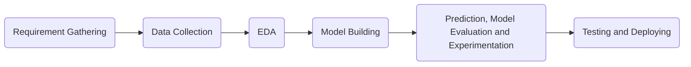
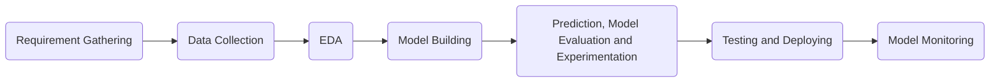

# Introduction
A typical machine learning (ML) workflow looks as below,

Once the model is deployed and is in production, it has to be continuously monitored. The meaning of monitoring here is to observe from time-to-time if the model is performing the task that it was built for.

Model monitoring is the last process that in the ML workflow. The complete ML workflow now looks as below,

# What is Model Monitoring?
Model monitoring is the process of continuously observing a deployed machine learning model to ensure it is performing as expected. It involves tracking various metrics and detecting changes in the model's behavior over time. The reason as to why model monitoring important is to ensure that there is no model drift.

### What is model drift?
Model drift occurs when an ML model's performance degrades over time due to changes in the data distribution it is trained on, or the underlying relationships between features and target variables. Model drift can occur in 2 ways,
1. Data drift
2. Concept drift

### What is data drift?
Data drift occurs when the distribution of data changes significantly over time. This means that the characteristics of the data that an ML model was trained on, no longer accurately represent the new data it is encountering.

### What is concept drift?
Concept drift occurs when the underlying relationships between input features and target variables in an ML model change over time. This means that the patterns learned by the model during training are no longer representative of the new data it is encountering in the present.

##### Types of concept drift

### Why is model monitoring important?
- Maintain model effectiveness: Model monitoring ensures that the model continues to perform well in a changing environment.
- Preventing unexpected failures: It helps to detect issues early on, allowing for timely interventions.
- Ensuring dairness and bias mitigation: It helps to identify and address biases in the model.
- Compliance with regulations: Model monitoring makes sure that industry regulations are followed and standards are met.

### How to detect model drift?
- Monitor performance metrics: Changes in accuracy, precision, recall or other relevant metrics can be tracked.
- Compare model predictions to the ground truth: The model's outputs against actual outcomes can be evaluated.
- Conduct statistical tests: The new data can be compared with the training data. The comparison can done by performing statistical tests like Kolmogorov-Smirnov (KS) test (for numerical data) or chi-square test (for categorical data).
- Analyze model coefficients: Changes in the weights of the features can be examined.

### What should be done if model drift is detected?
1. Retrain the model by incorporating the new data into the training dataset. If necessary, fine tune hyperparameters or explore different model architectures.
2. Reinforcement learning with human feedback (RLHF): A continuous feedback is collected from the user that is interacting with the model on the reponses it generates. This feedback is fed back to the model and it is retrained. This is a continuous process.

# Excercise
1. Create a Jupyter Notebook, `excercise.ipynb`.
2. Download the dataset, link: https://archive.ics.uci.edu/dataset/275/bike+sharing+dataset.
3. Split the dataset into 2 parts, historical dat and recent data.
4. Perform statistical test on both the datasets to observe any deviations.
5. Train a model on the historical dataset and compute the performance metrics.
6. Predict using the recent dataset and compute the performance metrics.
7. Log the metrics, artifacts and etc using MLflow.
8. Launch MLflow, using, `mlflow ui`, to observe and compare the logged items.