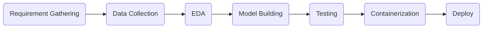
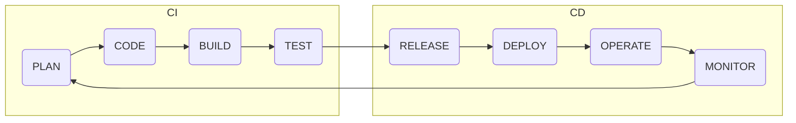

# Introduction
The following flowchart shows the lifecycle of an ML project,

In the lifecycle above the code changes keep happening quite frequently at different steps, and it is imperative to make sure that after code commit, the code does not break. Hence, developers carry out unit tests to ensure that their addition to the code base has not had a disastrous effect.

This task of developing, testing, and deploying is a tedious task if done manually. This is where automated pipelines come into the picture. These pipelines are divided into 2 parts,
1. Continuous Integration (CI)
2. Continuous Delivery (CD)

The following figure illustrates the CI/ CD pipeline,

#