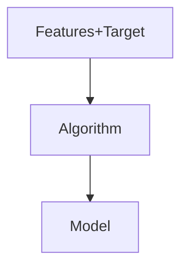
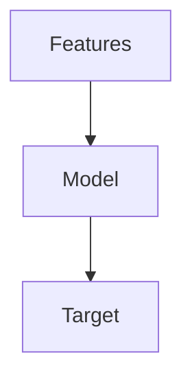

# Introduction

Supervised learning models are applied on datasets that have both features and label (target variable). For example,

| age | gender | years_of_experience | salary |
| :-: | :-: | :-: | :-: |

The task of a supervised machine learning algorithm is to make predictions what the target variable can be. The target variable can be either continuous (numerical) or categorical (class) in nature. In the above example, the target variable is salary of the employee which is continuous in nature.

Consider another example,

| age | income | number_of_cars | will_default |
| :-: | :-: | :-: | :-: |
|  |  |  | Yes |
|  |  |  | No |
|  |  |  | No |
|  |  |  | Yes |
|  |  |  | Yes |
|  |  |  | No |

The target variable is if a customer will default on the loan or not.

### Types of Supervised ML Algorithms:
1. Regression: The tasks in which a continuous value is being predicted are called regression tasks. 
2. Classification: The tasks in which a categorical value is being bredicted are called classification tasks. The target variable in a classification task may have,
    - Two classes: The classification is called binary class classification.
    - Multiple classes: The classification is called multi class classification.

# The Basic ML Setup

### Model Training
The features are fed as input to an algorithm, the algorithm learns the equation that maps the inputs to the output. Once the algorithm learns the mapping equation, the model is said to be trained.

### Prediction
New data (features only) is now fed to the trained model, and the model now predicts the target as ouput.

The is how supervised learning models work.