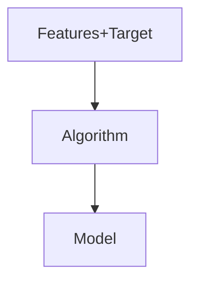
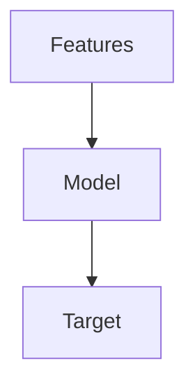

# Introduction
Unsupervised learning models are applied on data that only has features and no label/ target variable. For example,

| age | income | total_purchase_value | number of orders |
| :-: | :----: | :------------------: | :--------------: |

The task of an unsupervised learning algorithm is not to make a prediction, but to find a relationship or similarity between rows or a cluster of rows.

# The Basic ML Setup

### Model Training
The features are fed as input to an algorithm, the algorithm learns the equation that maps the inputs to the output. Once the algorithm learns the mapping equation, the model is said to be trained.

### Prediction
New data (features only) is now fed to the trained model, and the model now predicts the target as ouput.

The is how supervised learning models work. But consider the case where target variable is not present in the dataset. In this scenario, the target variables have to be found before any prediction can be made using them.

Unsupervised ML models are used to find these target variables.

# Toy Data
Consider the following toy data,

| serial_number |   id   | n_clicks | n_visits | amount_spent | amount_discount | days_since_registration |
| :-----------: | :----: | :------: | :------: | :----------: | :-------------: | :---------------------: |
| 0 | 1476 | 130 | 65 | 213.905831 | 31.600751 |  |