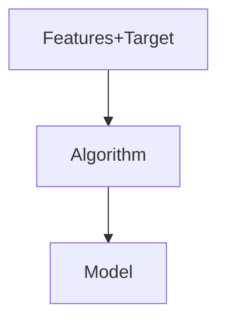
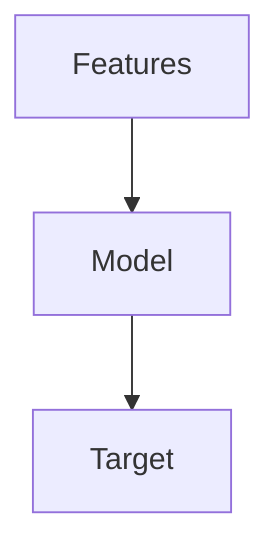

# Introduction
Unsupervised learning models are applied on data that only has features and no label/ target variable. For example,

| age | income | total_purchase_value | number of orders |
| :-: | :----: | :------------------: | :--------------: |

The task of an unsupervised learning algorithm is not to make a prediction, but to find a relationship or similarity between rows or a cluster of rows.

# The Basic ML Setup

### Model Training
The features are fed as input to an algorithm, the algorithm learns the equation that maps the inputs to the output. Once the algorithm learns the mapping equation, the model is said to be trained.

### Prediction
New data (features only) is now fed to the trained model, and the model now predicts the target as ouput.

The is how supervised learning models work. But consider the case where target variable is not present in the dataset. In this scenario, the target variables have to be found before any prediction can be made using them.

Unsupervised ML models are used to find these target variables.

# Toy Data
Consider the following toy data from an online market place,

| serial_number |   id   | n_clicks | n_visits | amount_spent | amount_discount | days_since_registration |
| :-----------: | :----: | :------: | :------: | :----------: | :-------------: | :---------------------: |
| 0 | 1476 | 130 | 65 | 213.905831 | 31.600751 |  |
| 1 | 1535 | 543 | 46 | 639.223004 | 5.689175 |  |
| 2 | 1807 | 520 | 102 | 1157.402763 | 844.321606 |  |
| 3 | 1727 | 702 | 83 | 1195.90363 | 850.041757 |  |
| 4 | 1324 | 221 | 84 | 180.754616 | 64.283300 |  |

### How can this data benefit the market place?
The market place can use this to find different clusters of customers (i.e., customer segmentation). And this is what unsupervised ML models are used for. Meaning, unsupervised ML models are used to cluster the similar data points together and assign labels to them.

# What is Clustering?
Clustering is grouping similar items together. If the market place data is plotted, then it is likely that many inherent patterns can be visualized. The inherent patterns can be grouped together to form clusters, thereafter, a strategy can be applied to each of the clusters, or one strategy can be applied to all the clusters.

Data points that are close and are a part of the cluster, can be said to have something in common. The ideal case of clustering is such that, the different clusters are clearly separated.

### Deductions
1. Points within a cluster are similar to each other.
2. Points in different clusters should be clearly separated.

The grouping of data points into clusters is based on similarity, and distance is used as the metric to define similarity. The different distance metrics are, Manhattan, Euclidean, Hamming, Minkowski, etc.

### Definition of Similarity
Closeness of data points defines similarity. But closeness should also make sense. For example, in the online market place data, the customers who spend the same amount of money can be considered similar.

Plot n_clicks vs amount_spent. The people who fall in a cluster where the n_clicks and amount_spent is high, make a good cluster. Meaning, they are good spenders and are active on the platform. Hence, a business strategy can be drawn to deal with customers in each cluster. Also, further micro-analysis can be done once the clusters are formed.

### How to ensure if a cluster is good or bad?
Since there are no y_labels, business sense plays a crucial role in determining the goodness of clusters.

Once the clusters are formed, the customers can be filtered and their mean purchase value can be found. Further analytical techniques can be applied to each one of the clusters differently. Although, there are techniques to understand the goodness, they offer no certainty on the goodness.

### Terminology
- Intercluster distance: Distance between two different clusters.
- Intracluster distance: Distance between the data points within a single cluster.

In order to clearly separate the clusters, intercluster distance should be maximized and intracluster distance should be minimized.

There can be many different distances that can be measured, for example,
1. Distance between the furthest points of the both clusters.
2. Distance between the nearest points of the both clusters.
3. Distance between the centroid of the both clusters.

The different distance metrics that can chosen from are,
1. Manhattan
2. Euclidean
3. Cosine

The distance metric chosen is entirely dependent on the type of or nature of the business. In practice, if the number of dimensions are low in number, euclidean distance is preferred. Manhattan distance is preferred if the number of dimensions are low to medium in number. Cosine distance is preferred if the number of dimensions are high in number.

The definition of low, medium and high is dependent upon the size of the dataset/ business case. The best practice is to find the results with each of the distances and then check how better the results are with each distance metric.

### Evaluation of Goodness of Clusters
#### For intercluster distance
- The true representation of the distance is defined by the minimun of all the intercluster distances found by comparing all the intercluster distances.
- Meaning, if the minimum value of all the distances is big enough, then the separation is said to be good.

#### For intracluster distances
- The true representation of the distance is defined by the maximum of all the intracluster distances within a cluster, found by comparing all the intracluster distances.
- Meaning, if the maximum value of all the distances is small enough, then the grouping is said to be close or in other words, cluster is said to be tight.

### Dunn Index
$\text{Dunn Index} = \frac{\text{min(Intercluster Distance)}}{\text{max(Intracluster Distance)}}$

$\text{Dunn Index} = \frac{min(d(i, j))}{max(d'(i, j))}$

Where, i and j are from different clusters.

There is no range for this. Meaning, it is not standardized.

When is the cluster said to be good? The minimum value of intercluster should be high, and the maximum value of intracluster distance should be low.

### Application of Clustering
1. Say you are given 10 million images of apparels, and you have to label each of the image as Jeans, Top, Shirt, Night Gown etc. 
    - Images are a d-dimensional vectors, and say that your images have 100 dimensions.
    - Therefore, the dimension of the data set will be 100 x 10000000
    - Clustering algorithm can be applied on this, say if the business knows that there are only 4 categories in their inventory. Then 4 clusters can be made, and once the clusters are created a few of the data points can be sampled form them and confirmation can be achieved.
2. Document labelling is another area where clusters can be applied.
    - Say there are 100s and 1000s of documents, and you want to find which document is about what (political, geography, legal, etc).
    - A vector of a document(s) can be made, and this can be fed to the clustering algorithm.

# Data Size and Curse of Dimensionality in Clustering Algorithms

### Data size and clustering
- More data points: Generally, having more data points can lead to more robust and informative clustering results. With more data, With more data points, the clusters are likely to be more representatitve of the underlying structure in the data.
- Feature regulation: However, the number of features (dimensions) also plays a crucial role. Too many features can lead to "curse of dimensionality", making distances between data points less meaningful and clustering algorithms less effective. It is important to choose a relevant subset of features that best capture the inherent groupings in your data.

### Curse of dimensionality
- Distance based algorithms: Distance-based clustering algorithms like K-means can struggle in high-dimensional data. In high dimensions, the distances between all data points tend to become very similar, making it difficult to distinguish between clusters effectively. Imagine data points scattered across a vast, feature-rich landscape; distances become less informative about their true relationships.
- Impact on clustering: The curse of dimensionality can lead to several issues,
    - Meaningless Distances: Distances between points become less informative about their similarity in high dimensions.
    - "Spread-Out" Data: Data points tend to be far apart from each other in high dimensions, making it harder to identify cohesive clusters.
    - Increased Computational Cost: Distance calculations become more expensive as the dimensionality increases.

### Alternative approaches for high dimensions
- Dimensionality Reduction Techniques: Techniques like Principal Component Analysis (PCA) can help reduce the number of features while retaining the most important information for clustering. This can alleviate the curse of dimensionality and improve the performance of distance-based algorithms.
- Density-Based Clustering: Algorithms like DBSCAN (Density-Based Spatial Clustering of Applications with Noise) are less susceptible to the curse of dimensionality. They focus on identifying areas with high data density, which can be more effective for clustering in high-dimensional data.